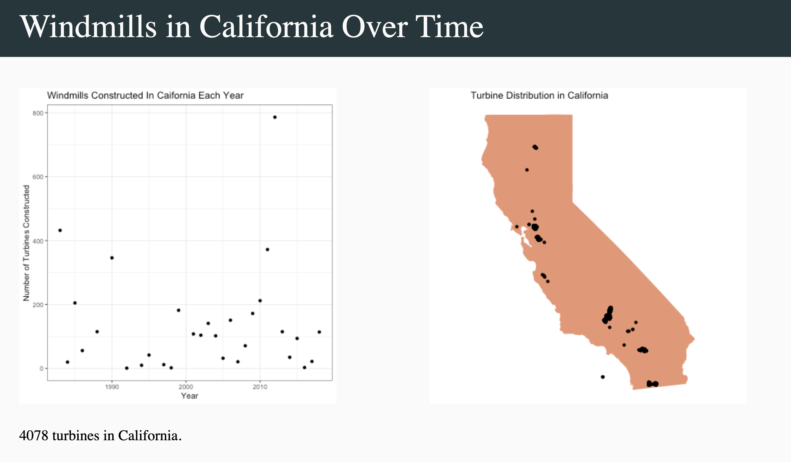
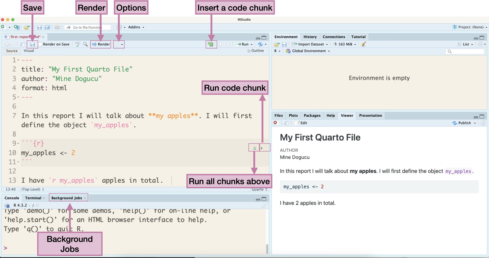
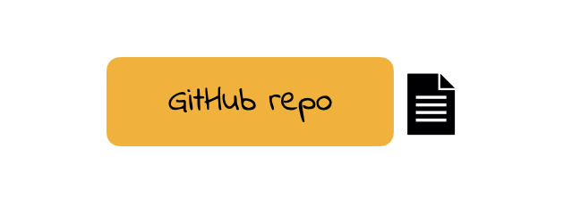
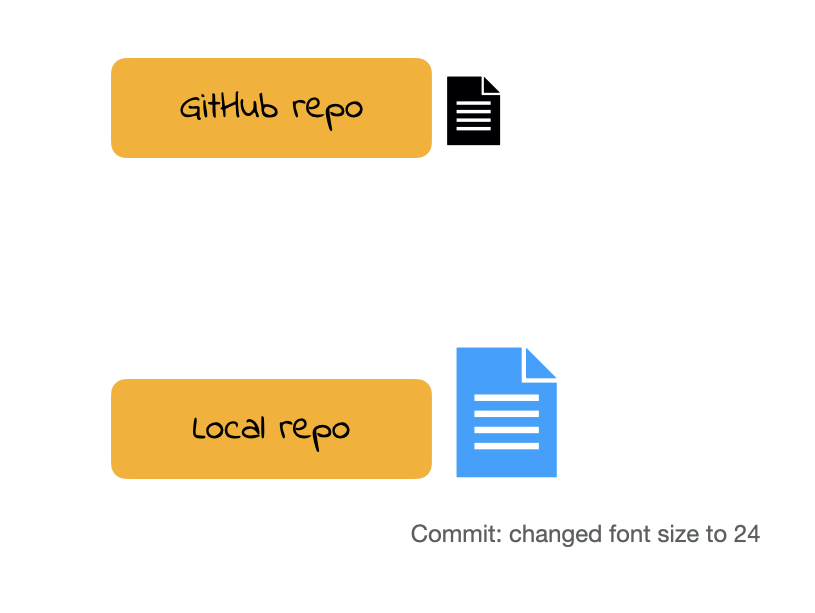
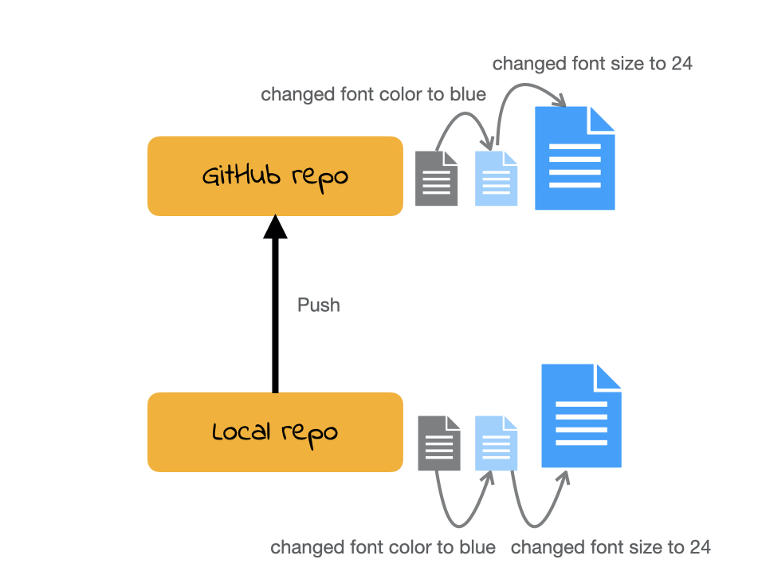

```{r}
#| echo: false
library(DiagrammeR)
library(DiagrammeRsvg)
library(rsvg)
```

# Getting to Know Each Other

## Merhaba

Hello\
`Private Sub Form_Load() MsgBox "Hello, World!" End Sub`\
Hallo\
مرحبا\
`print('Hello world')`\
नमस्ते & السلام عليكم\
`print("Hello world")`\
`<html> Hello world</html>`\
¡Hola!\
سلام

## Meet and Greet Each Other

In groups three or four meet and greet each other. You may consider sharing


Your name\
Your year\
I live ...\
What excites me about this quarter is ...\
One academic strength you have  
One personal strength you have


# Getting to Know the Course

##  Course website

::: font100
The most important thing about this course:
:::

[The course website](https://introdata.science)

Make sure to bookmark it.

## Poll Everywhere

:::{.font50}

[PollEv.com/minedogucu800](https://pollev.com/minedogucu800)

:::

## What is Data Science?

Think 💭 - Pair 👫🏽 - Share 💬

What do you think data science is about and what will we learn in this course? There is no right or wrong answer.

:::{.font50}
[PollEv.com/minedogucu800](https://pollev.com/minedogucu800)
:::

## What is Data Science?

> Data science is an interdisciplinary academic field that uses statistics, scientific computing, scientific methods, processes, algorithms and systems to extract or extrapolate knowledge and insights from noisy, structured, and unstructured data. Wikipedia

## What is Data Science?


> Data science also integrates domain knowledge from the underlying application domain (e.g., natural sciences, information technology, and medicine). Data science is multifaceted and can be described as a science, a research paradigm, a research method, a discipline, a workflow, and a profession. Wikipedia

## Data Context

**What types of data will we use in this course** 

We will use a variety of datasets from biological studies to business answering questions serving different purposes in life. Data will come different size, shape, and form and will include numbers, categories, text etc.

## Course Context

**Is this a statistics course or a computing course?**

A little bit of both. 

. . .

**Do I need prior programming/statistics experience?**

No


## Example work by students

```{r}
#| echo: false
#| out-width: 80%
#| fig-align: center
#| fig-alt: 'A presentation slide titled "Windmills in California Over Time" features two data visualizations. The left panel is a scatter plot titled  "Windmills Constructed in California Each Year," showing the annualnumber of turbines built from the late 1980s to the mid-2010s. It displays a sharp peak in construction around 2012 (nearly 800 turbines) and another significant peak in the late 1980s (over 400 turbines), with fluctuating, generally lower numbers throughout the 1990s and 2000s. The right panel is a map titled "Turbine Distribution in California," showing the outline of California with black dots representing wind turbine locations. These dots are heavily concentrated in specific regions, primarily around the San Francisco Bay Area (Altamont Pass region) and in Southern California (Tehachapi Pass and San Gorgonio Pass areas). A caption at the bottom states "4078 turbines in California.'


```

## How to be successful in this course

- Be punctual
- Be organized
- Do the work

## How to make your professor happy

- Be kind
- Be honest


# Getting to Know the Toolbox

## hello woRld

<center>

<iframe title='Embedded Media titled: 01a-r-rstudio-edited' aria-label='Embedded Media titled: 01a-r-rstudio-edited' width="560"  height="315"  src="https://uci.yuja.com/V/Video?v=15734636&node=67845604&a=67727935&preload=false" frameborder="0" webkitallowfullscreen mozallowfullscreen allowfullscreen loading="lazy"></iframe>

</center>

Code from this video is provided on the next few slides.

## Code from previous video


```{r}
#| error: true
print("hello woRld")
my_apples <- 4
my_apples
my_apples - 1
My_apples
n_apples <- c(7, my_apples, 13)
my_apples
my_apples <- my_apples - 1
n_apples

```

## Code from previous video 

```{r}
names <- c("Menglin", "Gloria", "Robert")
data.frame(friends = names, apples = n_apples)
people <- data.frame(friends = names, apples = n_apples)
people[2, 1]
people[3, ]
people[ , 2]
```


## Object assignment operator

```{r}
my_apples <- 4
```


. . .

|                            | Windows        | Mac              |
|----------------------------|----------------|------------------|
| Shortcut     | Alt + -        | Option + -       |


## R is case-sensitive


```{r}
#| error: true
My_apples
```

## Characters

If something comes in quotes, it is not defined in R. Later in the quarter we will call these as characters. More on that later.


```{r}

n_apples <- c(7, my_apples, 3)

names <- c("Menglin", "Gloria", "Robert")

data.frame(person = names, apple_count = n_apples)
```


## Vocabulary

```{r eval=FALSE}
do(something)
```

`do()` is a function;   
`something` is the argument of the function.

. . .

```{r eval=FALSE}
do(something, colorful)
```

`do()` is a function;   
`something` is the first argument of the function;   
`colorful` is the second argument of the function.


## Getting Help

In order to get any help we can use `?` followed by function (or object) name. 

```{r eval=FALSE}
?c
```

## Do not copy paste

::: callout-tip
You should not copy paste code from my slides or from the internet. 
Part of learning to code is building up your muscle memory. 
:::

## tidyverse style guide

>canyoureadthissentence?

## tidyverse style guide

:::: {.columns}

::: {.column width="40%"}
```{r eval = FALSE}
n_apples <- c(7, my_apples, 3)

names <- c("Menglin", "Gloria", "Robert")

data.frame(
  person = names, 
  apple_count = n_apples
  )
```
:::

::: {.column width="60%"}
- After function names do not leave any spaces.

- Before and after operators (e.g. <-, =) leave spaces. 

- Put a space after a comma, **not** before. 

- Object names are all lower case, with words separated by an underscore.

:::

::::

## Indentation

::: callout-tip

You can let RStudio do the indentation for your code.

:::
    

# Literate Programming 

## Quarto

<center>

<iframe title='Embedded Media titled: 01b-quarto-edited' aria-label='Embedded Media titled: 01b-quarto-edited' width="560"  height="315"  src="https://uci.yuja.com/V/Video?v=15735503&node=67847130&a=165278068&preload=false" frameborder="0" webkitallowfullscreen mozallowfullscreen allowfullscreen loading="lazy"></iframe>

</center>

The file I create in the video similar to the [my-first-report.qmd](my-first-report.qmd) file provided here.

## markdown `r fontawesome::fa(name = "markdown")`

markdown is a markup language. Markup languages instruct software on how to display or interpret text and data. We use markdown within a Quarto document.

:::: {.columns}

::: {.column width="40%"}

```

_Hello world_ 

__Hello world__

~~Hello world~~ 
```
:::

::: {.column width="60%"}
_Hello world_ 

__Hello world__

~~Hello world~~ 
:::

::::

[markdown cheatsheet](https://www.markdownguide.org/cheat-sheet/)

## Quarto parts


```{r}
#| echo: false
#| fig-align: center
#| fig-alt: 'A screenshot of the RStudio IDE displaying a Quarto document. The screen is divided into multiple panes. The left pane shows the Quarto source code, which includes YAML metadata (title, author, format: html), a text paragraph, and an R code chunk (`my_apples <- 2`). The bottom-left pane shows the R console and "Background Jobs" tab. The right pane displays the rendered output of the Quarto document, showing "My First Quarto File", the author, the descriptive text, and the result "my_apples <- 2" leading to "I have 2 apples in total". Pink labels and arrows highlight key RStudio features: top toolbar buttons for "Save", "Render", "Options", and "Insert a code chunk"; buttons next to a code chunk for "Run code chunk" and "Run all chunks above"; and the "Background Jobs" tab in the console.'


```


Quarto source file can be accessed here [my-first-report.qmd](my-first-report.qmd).


## Slides for this course

Slides that you are currently looking at are also written in Quarto. You can take a look at them on our course's [GitHub organization](https://github.com/stats6-sp26) in the slides repo.

# R packages

## Phone apps vs. R packages

:::: {.columns}

::: {.column width="50%"}
When you buy a new phone it comes with some apps pre-installed.

- Calendar
- Email
- Messages
:::

::: {.column width="50%"}
If you want to use a different app you can install it.

- Instagram
- GMail
- BlueSky
:::

::::

When you download R for the first time to your computer. It comes with some packages already installed. You can also install many other R packages.

## R packages

What do R packages have? All sorts of things but mainly

- functions 

- datasets

## R packages

Try running the following code:

```{r error = TRUE}
beep()
```

Why are we seeing this error? 


## Installing packages

In your **Console**, install the beepr package

```{r eval = FALSE}
install.packages("beepr")
```

We do this in the Console because we only need to do it once. If we add this code in Quarto, we will be installing the package again and again each time we render the document.


## Using beep() from beepr


Option 1
```{r warning = FALSE, eval = FALSE}
library(beepr)
beep()
```

More common usage. 

Useful if you are going to use multiple functions from the same package.
E.g. we have used many functions (ggplot, aes, geom_...) from the ggplot2 package. In such cases, usual practice is to put the library name in the first R chunk in the .qmd file.


## Using beep() from beepr

Option 2

```{r eval = FALSE}
beepr::beep()
```
Useful when you are going to use a function once or few times. Also useful if there are any conflicts. For instance if there is some other package in your environment that has a beep() function that prints the word beep, you would want to distinguish the beep function from the beepr package and the beep function from the other imaginary package. 

## Reading the documentation 

```{r}
#| eval: false
?beep
```

Running `?beep` in the Console opens the Help pane with the package documentation. We run this in the Console and not in Quarto so that we won't get the help every time we render the Quarto document.

. . .

beep {beepr} - indicates that the beep package is in the beepr package

. . .

Pay attention to parts of documentation: Description, Usage, Arguments, Details, Examples. At your stage Examples are a great resource.

. . .

## Reading the documentation 


`beep(sound = 1, expr = NULL)` indicates that the default sound is set to be 1. 

. . .

Pay attention to argument options.

## Usage example

```{r}
beepr::beep(sound = 8)
```

This should play the mariokart sound.


## Open Source

- Any one around the world can create R packages. 


- Good part: We are able to do pretty much anything R because someone from around the world has developed the package and shared it. 


- Bad part: The language can be inconsistent. 


- Good news: We have tidyverse. 


## Tidyverse


>The tidyverse is an opinionated collection of R packages designed for data science. All packages share an underlying design philosophy, grammar, and data structures. 
                  tidyverse.org


## Tidyverse

In short, tidyverse is a family of packages. From practical stand point, you can install many tidyverse packages at once (and you did this). 


## Load tidyverse packages

We can also load multiple tidyverse packages all at the same time.

```{r message = TRUE}
library(tidyverse)
```


# Version Control

## Bad version control

::: {.incremental}

Does this look familiar?

- hw1

- hw1_final

- hw1_final2

- hw1_final3

- hw1_finalwithfinalimages

- hw1_finalestfinal

:::


## Good version control


What if we tracked our file with better names for each version and have only 1 file **hw1**?

::: {.incremental}

- hw1 ***added questions 1 through 5***

- hw1 ***changed question 1 image***

- hw1 ***fixed typos***

:::

. . .

We will call the descriptions in italic **commit** messages.


## git vs. GitHub

- git allows us to keep track of different versions of a file(s).

- GitHub is a website where we can store (and share) different versions of the files. 

## GitHub repo

```{r}
#| out.width: '40%'
#| fig-align: 'center' 
#| echo: false
#| fig-alt: 'An orange box labeled "GitHub repo" next to a black document icon.'

```

## Cloning a repo

```{r}
#| out.width: '55%'
#| fig-align: 'center'
#| echo: false
#| fig-alt: 'Diagram showing a GitHub repo with a document icon at the top, connected by a downward arrow labeled "Clone a repo" to a local repo with a document icon at the bottom.'

knitr::include_graphics('img/github-illustration.003.jpeg')
```

## Commiting a change 1

```{r}
#| out.width: '55%'
#| fig-align: 'center'
#| echo: false
#| fig-alt: 'A diagram with "GitHub repo" and a black document icon at the top. Below it, "Local repo" is shown with a blue document icon, implying a change  has been made locally. Text below reads "Commit: changed font color to blue".'

knitr::include_graphics('img/github-illustration.004.jpeg')
```

## Commiting a change 2

```{r}
#| out.width: '55%'
#| fig-align: 'center'
#| echo: false
#| fig-alt: 'A diagram showing a "GitHub repo" with a black document icon at the top. Below it, a "Local repo" is shown with a blue document icon, indicating a change. Text below the local repo says, "Commit: changed font size to 24".'


```

## Commiting a change 3

```{r}
#| out.width: '55%'
#| fig-align: 'center'
#| echo: false
#| fig-alt: 'A diagram depicting a "GitHub repo" with a black document icon at the top. Below it, a "Local repo" is shown with a sequence of three document icons representing commits: a gray icon, followed by a light blue icon with an arrow pointing to "changed font color to blue", and finally a larger, bright blue icon with an arrow pointing to "changed font size to 24".'

knitr::include_graphics('img/github-illustration.006.jpeg')
```

## Push

```{r}
#| out.width: '55%'
#| fig-align: 'center'
#| echo: false
#| fig-alt: 'A diagram illustrating the "Push" action in Git. A "Local repo" at the bottom shows a sequence of three commits represented by document icons: a gray one, a light blue one with text "changed font color to blue", and a bright blue one with text "changed font size to 24". An upward arrow labeled "Push" connects the "Local repo" to a "GitHub repo" at the top. The "GitHub repo" also displays the same sequence of three document icons representing the pushed commits.'


```

##  Git and GitHub demo


<center>

<iframe title='Embedded Media titled: 01c-github-edited' aria-label='Embedded Media titled: 01c-github-edited' width="560"  height="315"  src="https://uci.yuja.com/V/Video?v=15735817&node=67847829&a=212432377&preload=false" frameborder="0" webkitallowfullscreen mozallowfullscreen allowfullscreen loading="lazy"></iframe>

</center>

## R Project files


::: callout-tip
## Tip

Always use `.Rproj` file to open projects. Then open the appropriate `.qm`d / `.R` file from the Files pane. If you don't open `.Rproj` file you will not be able to see the Git pane.
:::


## Cloning a repo

**repo** is a short form of repository. Repositories contain all of your project's files as well as each file's revision history.

For this course our weekly repos (lecture code, activity etc.) are hosted on Github. 

To **clone** a GitHub repo to our computer, we first copy the cloning link as shown in screencast then start an RStudio project using that link.  

**Cloning** a repo pulls (downloads) all the elements of a repo available at that specific time. 


## Commits

Once you make changes to your repo (e.g. take notes during lecture, answer an activity question) you can take a snapshot of your changes with a commit.

This way if you ever have to go back in version history you have your older commits to get back to. 

This is especially useful, for instance, if you want to go back to an earlier solution you have committed.


## Push

All the commits you make will initially be local (i.e. on your own computer). 

In order for us to see your commits and your final submission on any file, you have to **push** your commits. In other words upload your files at the stage in that specific time.


## (An incomplete) Git/GitHub glossary

**Git:** is software for tracking changes in any set of files

**GitHub:** is an internet host for Git projects.

**repo:** is a short form of repository. Repositories contain all of your project's files as well as each file's revision history.

**clone:** Cloning a repo **pulls** (downloads) all the elements of a repo available at that specific time. 

**commit:** A snapshot of your repo at a specific point in time. We distinguish each commit with a **commit message**. 

**push:** Uploads the latest "committed" state of your repo to GitHub.


## Learning Tip of the Day

[Class Attendance in College: A Meta-Analytic Review of the Relationship of Class Attendance With Grades and Student Characteristics](https://journals.sagepub.com/doi/abs/10.3102/0034654310362998)
