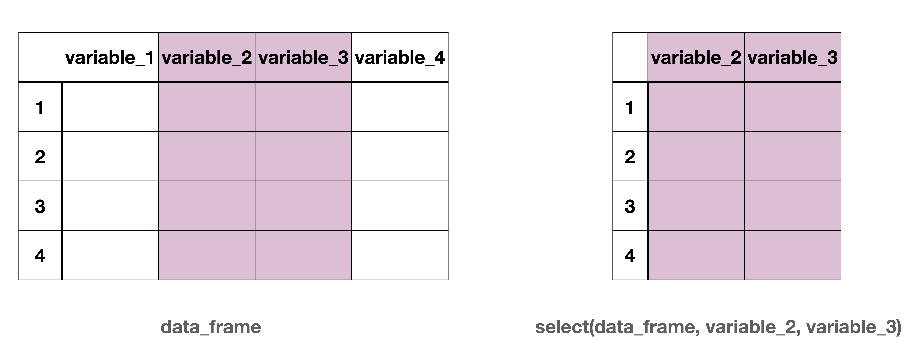
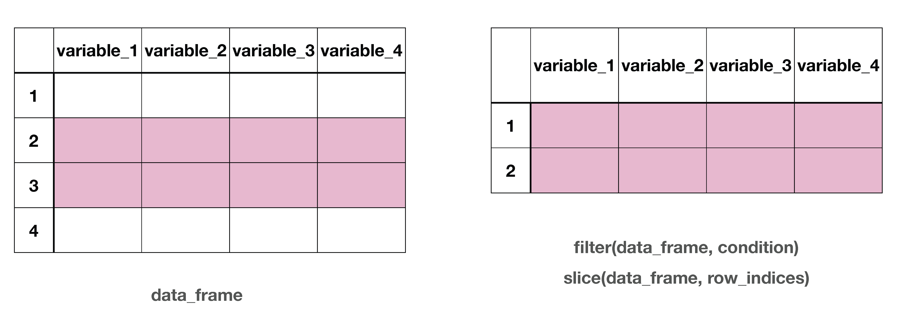

```{r}
#| echo: false
library(tidyverse)
library(janitor)
options(scipen = 999)
```

# Three solutions to a single problem

What is the average of 4, 8, 16 approximately?

## Breaking down the question

1.What is the average of <u>4, 8, 16</u> approximately?

. . .

2.What is the <u>average</u> of 4, 8, 16 approximately?

. . .

3.What is the average of 4, 8, 16 <u>approximately</u>?


## Solution 1: Functions within Functions


```{r}
c(4, 8, 16)
```

. . .

<hr>

```{r}
mean(c(4, 8, 16))
```

. . .

<hr>

```{r}
round(mean(c(4, 8, 16)))
```


## Problem!

**Problem with writing functions within functions**

Things will get messy and more difficult to read and debug as we deal with more complex operations on data.


## Solution 2: Creating Objects


```{r}
numbers <- c(4, 8, 16)
numbers
```

. . .

<hr>

```{r}
avg_number <- mean(numbers)
avg_number
```

. . .

<hr>

```{r}
round(avg_number)
```

## Problem!

**Problem with creating many objects**

We will end up with too many objects in `Environment`. 


## Solution 3: The (forward) Pipe Operator |> 

:::{.font75}
Shortcut: <br>Ctrl (Command) + Shift + M
:::

## RStudio settings


Make sure to select `Use native pipe operator` under `Tools > Global Options > Code` in RStudio

## Reading the pipe operator

::::{.columns}

:::{.column width="50%"}

```{r}
c(4, 8, 16) |> 
  mean() |> 
  round()
```

:::

:::{.column width="50%"}
Combine 4, 8, and 16 `and then`  
Take the mean   `and then`  
Round the output
:::

::::

. . .

The output of the first function is the first argument of the second function.

## Recall functions from algebra


Now we have $f \circ g \circ h (x)$  
or `round(mean(c(4, 8, 16)))`

. . .


::::{.columns}

:::{.column width="50%"}


```{r}
#| eval: false
h(x) |> 
  g() |> 
  f()
```

:::

:::{.column width="50%"}

```{r}
#| eval: false
c(4, 8, 16) |> 
  mean() |> 
  round()
```


:::

::::


## Data

```{r echo = FALSE, message = FALSE}
lapd <- read_csv(here::here("data/Police_Payroll.csv")) 
```


```{r}
glimpse(lapd)
```

Note that this data does not have documentation in R but the [documentation](https://controllerdata.lacity.org/Payroll/Police-Payroll/sxpf-rh6t) can be found online. 

## Tidy style names


```{r}

lapd <- clean_names(lapd)
glimpse(lapd)
```

The `clean_names()` function changes all variable names to tidyverse style. 

# Subsetting Data Frames

## subsetting variables/columns

```{r}
#| echo: false
#| fig-alt: "Side-by-side schematic of a data frame and a subset of it. On the left, a table labeled data_frame shows four rows (1–4) and four columns named variable_1, variable_2, variable_3, and variable_4. The columns variable_2 and variable_3 are shaded in pink to indicate selection. On the right, a smaller table labeled select(data_frame, variable_2, variable_3) displays only the two shaded columns, variable_2 and variable_3, for the same four rows, illustrating how selecting columns reduces the data frame to those variables."

```

. . .

Column-wise subsetting can be done using `select()`.

## subsetting observations/rows

```{r}
#| echo: false
#| fig-alt: "Side-by-side schematic illustrating row selection in a data frame. On the left, a table labeled data_frame shows four rows (1–4) and four columns (variable_1 to variable_4). Rows 2 and 3 are shaded in pink to indicate they are selected, while rows 1 and 4 are unshaded. On the right, a smaller table labeled filter(data_frame, condition) and slice(data_frame, row_indices) displays only the selected rows (rows 2 and 3) with all four columns preserved, demonstrating how filtering or slicing keeps rows that meet a condition."


```

. . .

Row-wise subsetting can be done with `slice()` and `filter()` 

## `select()`


`select()` is used to select certain variables in the data frame. 

::::{.columns}
:::{.column width=50%"}
```{r}
select(lapd, year, base_pay)
```
:::


:::{.column width=50%"}

```{r}
lapd |> 
  select(year, base_pay)
```

:::
::::

## `select()`

`select()` can also be used to drop certain variables if used with a negative sign.

```{r}
select(lapd, -row_id, -department_title)
```

## Selection helpers

`starts_with()`  
`ends_with()`  
`contains()`  

## `starts_with)`

```{r}
select(lapd, starts_with("q"))
```

## `ends_with()`

```{r}
select(lapd, ends_with("pay"))
```

## `contains()`

```{r}
select(lapd, contains("pay"))
```

## `slice()`

`slice()` subsets rows based on a row number.

The data below include all the rows from third to seventh, including the third and the seventh.

```{r}
slice(lapd, 3:7)
```

## Relational and Logical Operators

::::{.columns}


:::{.column width="50%"}


| Operator | Description              |
|----------|--------------------------|
| <        | Less than                |
| >        | Greater than             |
| <=       | Less than or equal to    |
| >=       | Greater than or equal to |
| ==       | Equal to                 |
| !=       | Not equal to             |

:::

:::{.column width="50%"}

| Operator | Description |
|----------|-------------|
| &        | and         |
| &#124;   | or          |

:::
::::


## `filter()`

`filter()` subsets rows based on a condition.

The data below includes rows when the recorded year is 2018.

```{r}
filter(lapd, year == 2018)
```

## Example 1

Q. How many LAPD staff members had a base pay higher than $100,000 in year 2018 according to this data?

##

```{r}
lapd |> 
  filter(year == 2018 & base_pay > 100000)
```

## Example 1


```{r}
lapd |> 
  filter(year == 2018 & base_pay > 100000) |> 
  nrow()
```

## Example 2

Q. How many observations are available between 2013 and 2015 including 2013 and 2015?

. . .

```{r}
lapd |> 
  filter(year >= 2013 & year <= 2015) 
```

## Example 2


```{r}
lapd |> 
  filter(year >= 2013 & year <= 2015) |> 
  nrow()
```

## Example 3

Q. How many LAPD staff were employed full time in 2018?


```{r}
lapd |> 
  filter(employment_type == "Full Time" & year == 2018) |> 
  nrow()
```

## Data frame is unchanged


We have done all sorts of selections, slicing, filtering on `lapd` but it has not changed at all. Why do you think so?

```{r}
glimpse(lapd)
```

## Moving forward


Moving forward we are only going to focus on year 2018, and use `job_class_title`, `employment_type`, and `base_pay`. Let's clean our data accordingly and move on with the smaller `lapd` data that we need.

## Moving forward

```{r}
lapd |> 
  filter(year == 2018) |> 
  select(job_class_title, employment_type, base_pay)
```

## Moving forward

```{r}
lapd <- 
  lapd |> 
  filter(year == 2018) |> 
  select(job_class_title, employment_type, base_pay)
```

## Moving forward

```{r}
glimpse(lapd)
```

# Changing Variables

## Goal

Create a new variable called `base_pay_k` that represents `base_pay` in thousand dollars.

## `mutate()`


```{r}
lapd |> 
  mutate(base_pay_k = base_pay/1000)
```

## Goal


Create a new variable called `base_pay_class` which has two classifications: "Less than 100K", "More than 100K".


## Side question

Let's first check to see there is anyone earning exactly 100K.

```{r}
lapd |> 
  filter(base_pay == 100000)
```

## `if_else()`

```{r}
lapd |> 
  mutate(
    base_pay_class = if_else(
      base_pay < 100000, "Less than 100K", "More than 100K"
    )
  )
```

## `if_else()` summary

```{r}
#| label: fig-if-else
#| echo: false
#| fig-alt: "Flowchart illustrating an if–else decision. At the top is the text if_else(condition, do this, do that). A central pink rectangle labeled condition branches into two paths: to the left, labeled if TRUE, an arrow points down to a green circle labeled do this; to the right, labeled if FALSE, an arrow points down to a green circle labeled do that. The diagram shows how a condition determines which action is executed."
#| out-width: 50%
knitr::include_graphics("img/if-else.png")
```

## Goal

Create a new variable called `base_pay_level` which has `Less Than 0`, `No Income`, `Between 0 and 100K` and `Greater than 100K`. 


## `case_when()`

```{r}
lapd |> 
  mutate(
    base_pay_level = case_when(
      base_pay < 0 ~ "Less than 0", 
      base_pay == 0 ~ "No Income",
      base_pay < 100000 & base_pay > 0 ~ "Between 0 and 100K",
      base_pay > 100000 ~ "Greater than 100K"
    )
  ) 
```

## Pipes

We can use pipes with ggplot too! 

```{r}
#| output-location: column
lapd |> 
  mutate(base_pay_level = case_when(
    base_pay < 0 ~ "Less than 0", 
    base_pay == 0 ~ "No Income",
    base_pay < 100000 & base_pay > 0 ~ "Between 0 and 100K",
    base_pay > 100000 ~ "Greater than 100K")) |> 
  ggplot(aes(x = base_pay_level)) +
  geom_bar()
```

## `case_when()` summary

```{r}
#| label: fig-case-when
#| echo: false
#| fig-alt: "Flowchart illustrating case_when logic. At the top is the text case_when(condition1 ~ action1, condition2 ~ action2, condition3 ~ action3). A vertical sequence of pink rectangles labeled condition1, condition2, and condition3 represents conditions evaluated in order. For each condition, a rightward arrow labeled if TRUE leads to a green circle labeled action1, action2, or action3, respectively. If a condition is false, the flow continues downward to the next condition. If all conditions are false, a final arrow leads to a green circle labeled return NA. The diagram shows how the first true condition determines the returned action."
#| out-width: 50%
knitr::include_graphics("img/case-when.png")
```

## Goal

Make `job_class_title` and `employment_type` factor variables.

##

```{r}
lapd |> 
  mutate(
    employment_type = as.factor(employment_type),
    job_class_title = as.factor(job_class_title)
  ) 
```

## Changing variable types


`as.factor()` - makes a vector factor  
`as.numeric()` - makes a vector numeric  
`as.integer()` - makes a vector integer  
`as.double()` - makes a vector double  
`as.character()` - makes a vector character  

## Writing data

Once again we did not "save"
anything into `lapd`. As we work on data cleaning it makes sense not to "save" the data frames. Once we see the final data frame we want then we can "save" (i.e. overwrite) it.

. . .

In your lecture notes, you can do all the changes in this lecture in one long set of piped code. That's the beauty of piping!


## Cleaning in one long chain

```{r}
#| eval: false
lapd <- 
  lapd |> 
  clean_names() |> 
  filter(year == 2018) |> 
  select(job_class_title, employment_type, base_pay) |> 
  mutate(
    employment_type = as.factor(employment_type),
    job_class_title = as.factor(job_class_title),
    base_pay_class = if_else(
      base_pay < 100000, "Less than 100K", "More than 100K"
    ),
    base_pay_level = case_when(
      base_pay < 0 ~ "Less than 0", 
      base_pay == 0 ~ "No Income",
      base_pay < 100000 & base_pay > 0 ~ "Between 0 and 100K",
      base_pay > 100000 ~ "Greater than 100K"
    )
  ) 
```


## Pay attention to first argument

::: callout-warning

The functions `clean_names()`, `select()`, `filter()`, `mutate()` all take a data frame as the first argument. Even though we do not see it, the data frame is piped through from the previous step of code at each step. 
When we use these functions without the `|>` we have to include the data frame explicitly.

::::{.columns}
:::{.column width="50%"}
Data frame is used as the first argument
```{r}
#| eval: false
clean_names(lapd)
```
:::

:::{.column width="50%"}
Data frame is piped

```{r}
#| eval: false
lapd |> 
  clean_names()
```
:::
::::
:::

## Learning Tip of the Day

[Exercise Improves Academic Performance](https://papers.ssrn.com/sol3/papers.cfm?abstract_id=3033774)