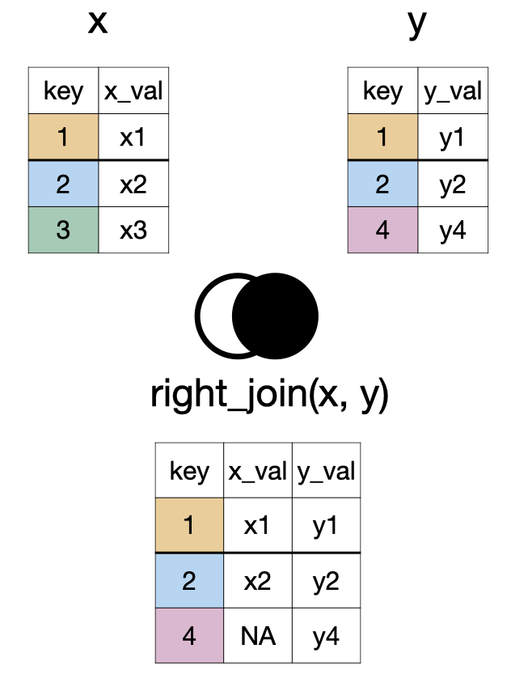
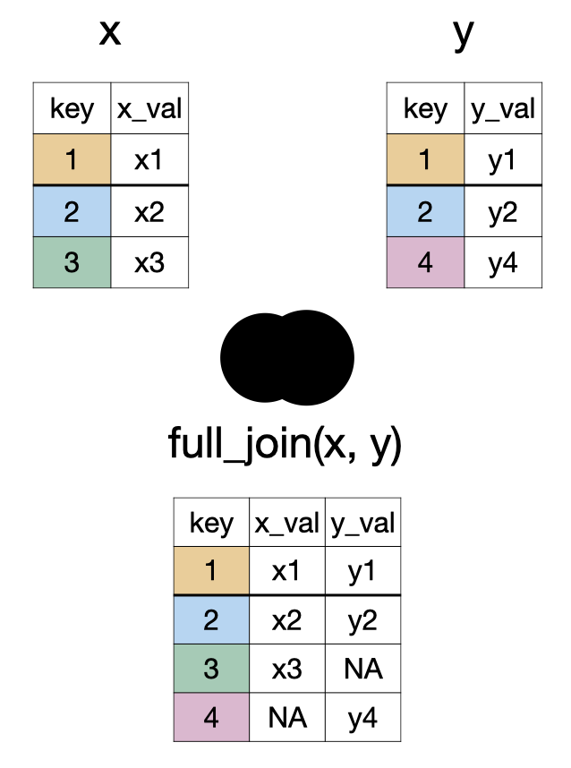
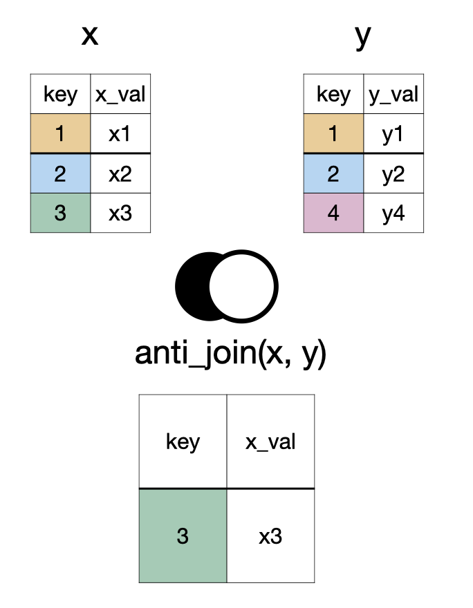
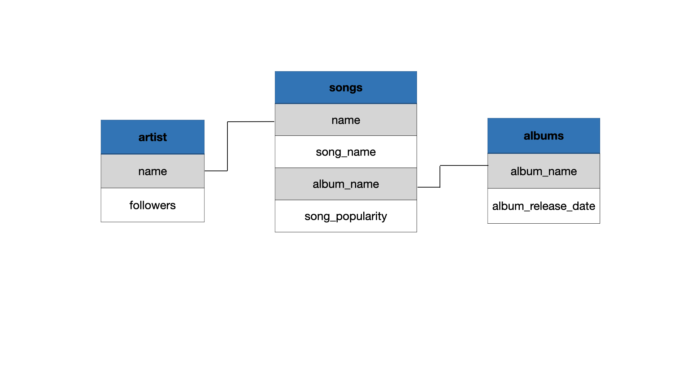

```{r}
#| echo: false
library(tidyverse)
library(janitor)
options(scipen = 999)
```


```{r}
#| echo: false
lapd <- 
  read_csv(here::here("data/Police_Payroll.csv")) |> 
  janitor::clean_names() |> 
  filter(year == 2018) |> 
  select(job_class_title, 
         employment_type, 
         base_pay) |> mutate(employment_type = as.factor(employment_type),
           job_class_title = as.factor(job_class_title),
           base_pay_level = case_when(
    base_pay < 0 ~ "Less than 0", 
    base_pay == 0 ~ "No Income",
    base_pay < 100000 & base_pay > 0 ~ "Between 0 and 100K",
    base_pay > 100000 ~ "Greater than 100K")) 


artists <- readxl::read_xlsx("../data/spotify.xlsx", sheet = "artist")
songs <- readxl::read_xlsx("../data/spotify.xlsx", sheet = "top_song")
albums <- readxl::read_xlsx("../data/spotify.xlsx", sheet = "album") |> 
  mutate(album_release_date = lubridate::ymd(album_release_date))
```

## Data

```{r}
glimpse(lapd)
```


# Review of Aggregating Data


## Data vs. Aggregate Data

::::{.columns}
:::{.column width="50%"}
### Data
Observations
:::

:::{.column width="50%"}
### Aggregate Data
Summaries of observations
:::
::::

## Aggregating Categorical Data

Categorical data are summarized with **counts** or **proportions**.

## Counts and proportions


```{r}
lapd |> 
  count(employment_type)
```

. . .

```{r}
lapd |> 
  count(employment_type) |> 
  mutate(prop = n/sum(n))
```

## Aggregating Numerical Data

Mean, median, standard deviation, variance, and quartiles are some of the numerical summaries of numerical variables. Recall


```{r}
summarize(lapd, 
          mean_base_pay = mean(base_pay),
          sd_base_pay = sd(base_pay))
```

# Aggregating Data By Groups

## `group_by()`

```{r}
#| label: fig-group-by
#| echo: false
#| fig.cap: Grouping a data frame by a specific variable
#| fig-alt: "Side-by-side schematic illustrating grouping in a data frame. On the left, a table labeled data_frame shows four rows (1–4) and four columns (variable_1 to variable_4). Values in variable_2 are highlighted with two colors, indicating two groups: rows 1 and 4 share one group, and rows 2 and 3 share another. On the right, a table labeled group_by(data_frame, variable_2) shows the same data with all columns present, but rows are visually grouped by variable_2, using the same colors across all columns to indicate group membership."
knitr::include_graphics("img/group-by.png")
```

`group_by()` separates the data frame by the groups. Any action following `group_by()` will be completed for each group separately.

## Example

Q. What is the median salary for each employment type?

## Example

```{r}
lapd |> 
  group_by(employment_type)
```

## Example

Note that when `group_by()` is used there have been no changes to the number of columns or rows. 
The only difference we can observe is now `Groups: employment_type[3]` is displayed indicating the data frame (i.e., tibble) is divided into three groups.

## Example

```{r}
lapd |> 
  group_by(employment_type) |> 
  summarize(med_base_pay = median(base_pay))
```

## Example

We can also remind ourselves how many staff members there were in each group.

```{r}
lapd |> 
  group_by(employment_type) |> 
  summarize(med_base_pay = median(base_pay),
            count = n())
```

Note that `n()` does not take any arguments.


# Data Joins

## `left_join(x, y)`

```{r}
#| echo: false
#| fig-align: center
#| fig-alt: "A diagram showing two tables, X and Y, being combined into a new table. Table X has columns 'key' and 'x_val', with keys 1, 2, 3. Table Y has 'key' and 'y_val', with keys 1, 2, 4. The new combined table includes all rows from Table X. For each key present in both tables (1 and 2), the matching 'y_val' from Table Y is added. For keys only in Table X (key 3), the 'y_val' column is filled with 'NA' (Not Applicable)"
knitr::include_graphics("img/left-join.png")
```

## `right_join(x, y)`


```{r}
#| echo: false
#| fig-align: center
#| out-width: 45% 
#| fig-alt: "A diagram showing two tables, X and Y, being merged based on a shared 'key' column. Table X has keys 1, 2, 3; Table Y has keys 1, 2, 4. The resulting combined table contains all rows from Table Y. Where keys match in both tables (1 and 2), corresponding values from X are included. For keys only present in Y (key 4), the 'x_val' column shows 'NA' (Not Applicable)."

```

## `full_join(x, y)`


```{r}
#| echo: false
#| fig-align: center
#| out-width: 45% 
#| fig-alt: "A diagram showing two tables, X and Y, being merged based on a shared 'key' column into a new combined table. Table X has keys 1, 2, 3; Table Y has keys 1, 2, 4. The resulting table includes all keys present in either X or Y (keys 1, 2, 3, 4). For keys found in both tables (1 and 2), corresponding values from both X ('x_val') and Y ('y_val') are shown. For keys only in Table X (key 3), its 'x_val' is included, and 'y_val' is marked 'NA' (Not Applicable). For keys only in Table Y (key 4), its 'y_val' is included, and 'x_val' is marked 'NA'"

```

## `inner_join(x, y)` and `semi_join(x, y)`

```{r}
#| echo: false
#| fig-align: center
#| out-width: 45% 
#| fig-alt: "A diagram showing two ways to process data from two tables, X and Y, based on a common 'key' column. Table X has keys 1, 2, 3, with an 'x_val' for each. Table Y has keys 1, 2, 4, with a 'y_val' for each. 1.  Inner Combine (labeled 'inner_join'): A new table is created that only includes rows where the 'key' is found in *both* Table X and Table Y (keys 1 and 2). For these matching keys, the new table displays the key, its 'x_val' from Table X, and its 'y_val' from Table Y. 2. Semi Combine (labeled 'semi_join'): A new table is created by taking only those rows from Table X whose 'key' also  appears in Table Y (keys 1 and 2). This new table only displays the 'key' and 'x_val' from Table X."
knitr::include_graphics("img/inner-semi-join.png")
```

## `anti_join(x, y)`

```{r}
#| echo: false
#| fig-align: center
#| out-width: 45% 
#| fig-alt: "A diagram showing two tables, X and Y, being processed to create a new table. Table X has keys 1, 2, 3, with corresponding 'x_val' values. Table Y has keys 1, 2, 4, with corresponding 'y_val' values. The new table, labeled 'anti_join(x, y)', is formed by taking only those rows from Table X whose 'key' is *not* found in Table Y. In this example, only the row with key 3 from Table X (and its 'x_val') is included in the final result."

```

## `something_join(x, y)`


<table aria-label="Comparison of dplyr join functions by row and column retention">
  <thead>
    <tr>
      <th scope="col">Function</th> <th colspan="2" scope="colgroup" style="text-align: center">x </th>
      <th colspan="2" scope="colgroup" style="text-align: center">y </th>
    </tr>
    <tr>
      <th scope="col">Type</th> <th scope="col">rows</th>
      <th scope="col">columns</th>
      <th scope="col">rows</th>
      <th scope="col">columns</th>
    </tr>
  </thead>
<tbody>

  <tr>
    <td>`left_join()`</td>
    <td>all</td>
    <td>all</td>
    <td>matched</td>
    <td>all</td>
  </tr>
  <tr>
    <td>`right_join()`</td>
    <td>matched</td>
    <td>all</td>
    <td>all</td>
    <td>all</td>
  </tr>
  <tr>
    <td>`full_join()`</td>
    <td>all</td>
    <td>all</td>
    <td>all</td>
    <td>all</td>
  </tr>
  <tr>
    <td>`inner_join()`</td>
    <td>matched</td>
    <td>all</td>
    <td>matched</td>
    <td>all</td>
  </tr>
  <tr>
    <td>`semi_join()`</td>
    <td>matched</td>
    <td>all</td>
    <td>none</td>
    <td>none</td>
  </tr>
  <tr>
    <td>`anti_join()`</td>
    <td>unmatched</td>
    <td>all</td>
    <td>none</td>
    <td>none</td>
  </tr>
</tbody>
</table>

## Data

::: {.panel-tabset}

## artists

```{r}
artists
```

## songs

```{r}
songs
```

## albums

```{r}
albums
```


:::

## Relational Schema

```{r}
#| echo: false
#| fig-align: center
#| fig-alt: "A diagram shows three related collections of music information: 'artist', 'songs', and 'albums'. The 'artist' collection includes the artist's name and their number of followers. The 'songs' collection lists the artist's name, the song's name, the album's name it's on, and its popularity. The 'albums' collection contains the album's name and its release date. Lines connect the artist's name from the 'artist' collection to the artist's name in the 'songs' collection, and similarly, album names link the 'songs' collection to the 'albums' collection. This structure connects song details to their respective artists and albums."

```

## `left_join()`

```{r}
left_join(songs, artists)
```

## `right_join()`


```{r}
right_join(songs, artists)
```


## `full_join()`

```{r}
full_join(songs, artists, by = "name")
```

## `full_join()` x2

```{r}
full_join(songs, artists, by = "name") |> 
  full_join(albums, by = "album_name")
```


## Practice

Complete the questions provided to you in the lecture notes.

## Learning Tip of the Day

[Reappraising test anxiety increases academic performance of first-year college students](https://psycnet.apa.org/record/2017-57283-001)