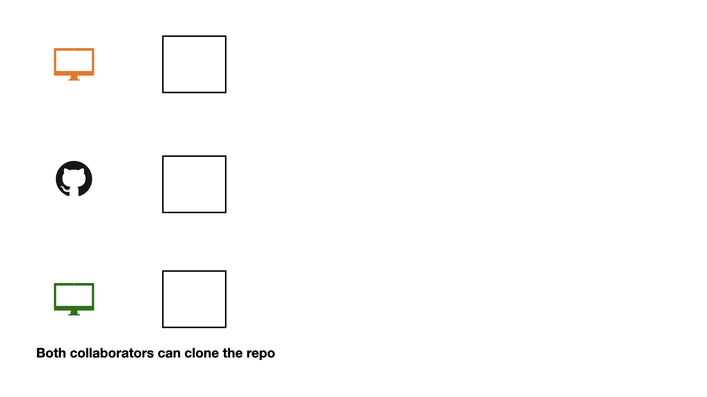
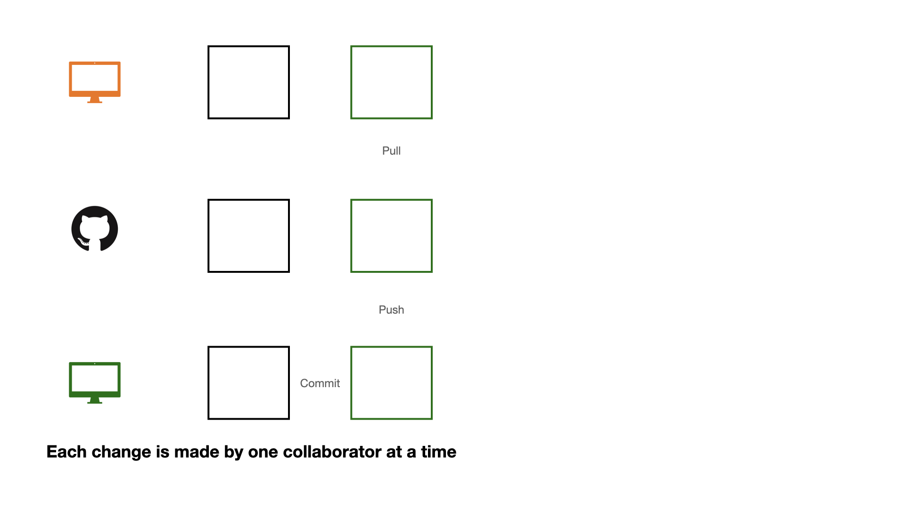
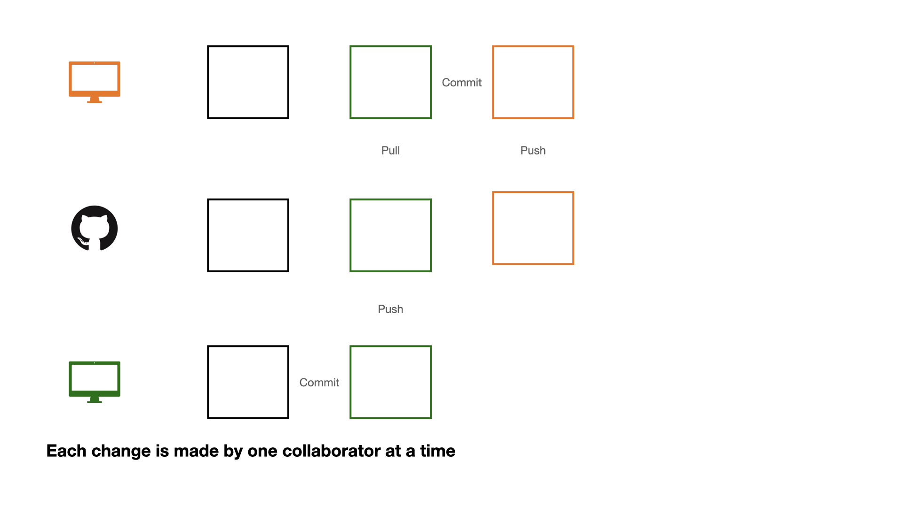
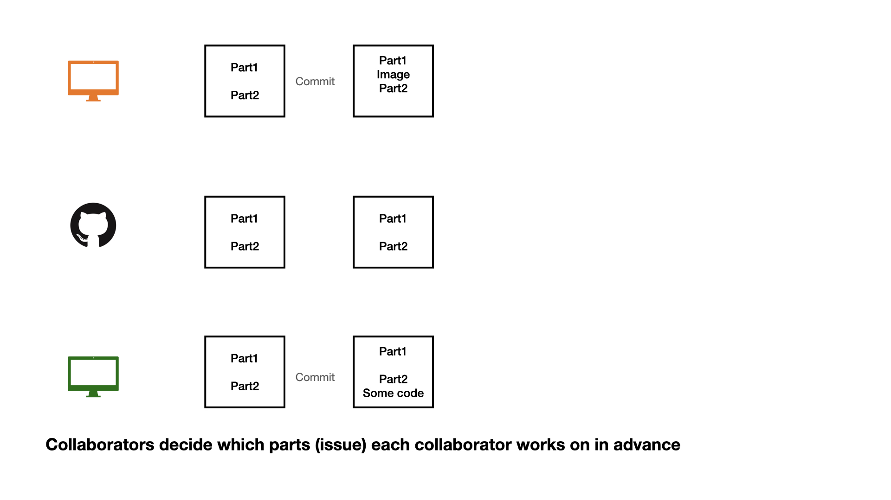
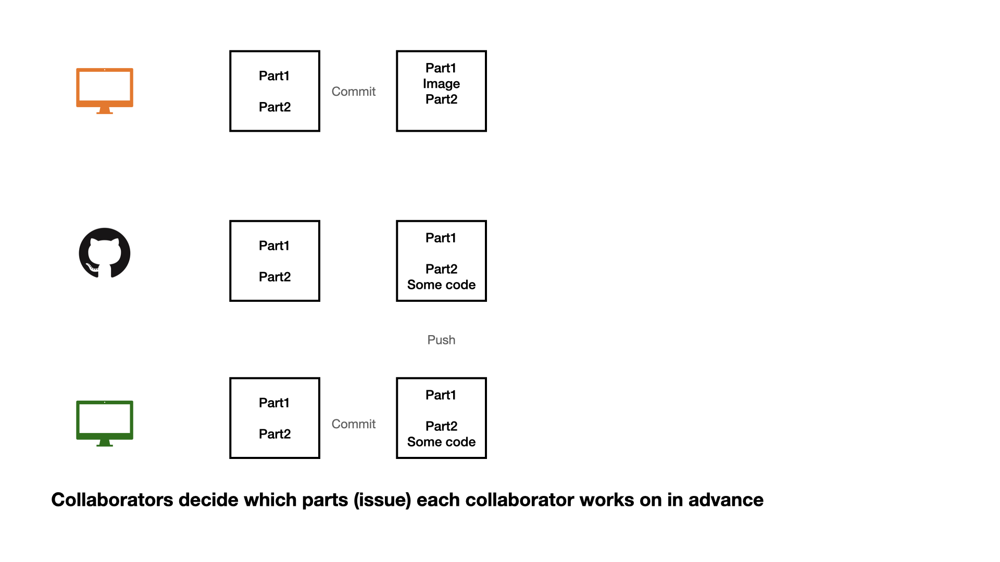
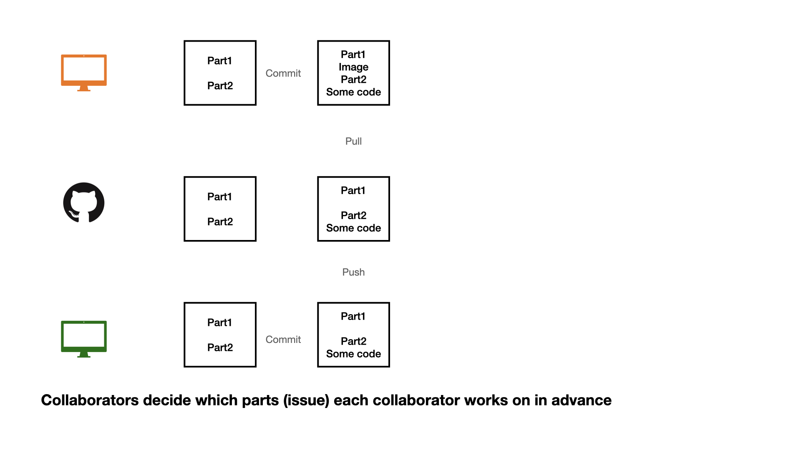
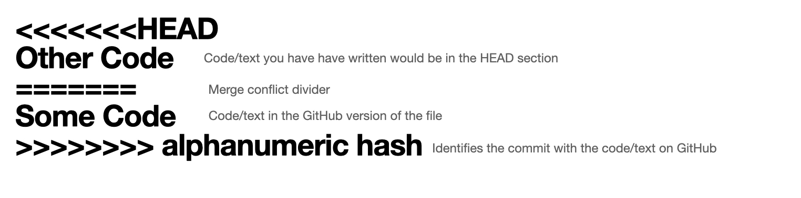
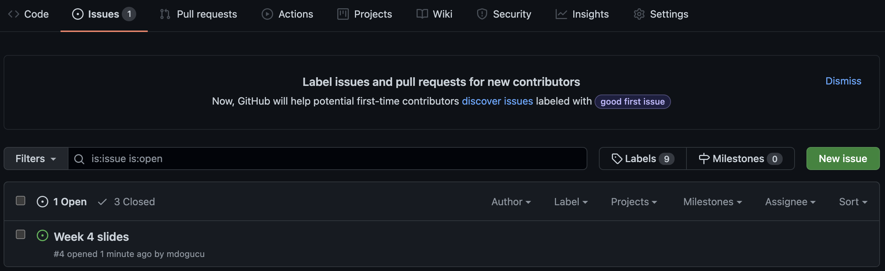

# Naming files


## 1. Be Descriptive and Concise


- Use names that clearly indicate the file's content or purpose.
- Avoid vague names like "Untitled.qmd" or "document.qmd".
- Example: "proposal.qmd" and `presentation.qmd`

## 2. Use Consistent Naming Conventions

Common conventions include:

**snake_case**: words_separated_by_underscores  
**kebab-case**: words-separated-by-hyphens  
**camelCase**: wordsJoinedWithCapitals  
**PascalCase**: WordsJoinedWithCapitals  

Following tidyverse style we use `snake_case` for object names in R and `kebab-case` for file and folder names.

## 3. Avoid Special Characters and Spaces

- Do not use spaces, slashes (/\), colons (:), asterisks (*), question marks (?), or quotes.
- Spaces can cause issues in command-line tools and some systems. Use underscores or hyphens instead.

## 4. Include Dates When Relevant

- Use the ISO 8601 format (YYYY-MM-DD) for easy sorting.

- Example: "meeting_notes_2026-04-16.md"


## 5. Use Enumeration and/or Letters 


- Use Enumeration and/or Letters for Easy Sorting

- Example: `lecture-01a-intro-toolkit.qmd`, `lecture-01b-intro-data.qmd`

- `01` represents the weekof the quarter
- `a` represents Monday `b` represents Wednesday

::: {.nonincremental}


## README.md

- README file is the first file users read. In our case a user might be our future self, a teammate, or (if open source) anyone.


- There can be multiple README files within a single directory: e.g. for the general project folder and then for a data subfolder. Data folder README's can possibly contain codebook (data dictionary).


- It should be brief but detailed enough to help user navigate. 

## README.md


- a README should be up-to-date (can be updated throughout a project's lifecycle as needed).


- On GitHub we use markdown for README file (`README.md`). Good news: [emojis are supported.](https://gist.github.com/rxaviers/7360908)


## README examples

- [STATS 6 website](https://github.com/stats6-sp26/website)
- [Museum of Modern Art Collection](https://github.com/MuseumofModernArt/collection)
- [R package bayesrules](https://github.com/bayes-rules/bayesrules)


# Importing Data

## Importing .csv Data 


```{r}
#| echo: true
#| eval: false
readr::read_csv("dataset.csv")
```


## Importing Excel Data

```{r}
#| echo: true
#| eval: false
readxl::read_excel("dataset.xlsx")
```


## Importing Excel Data

```{r}
#| echo: true
#| eval: false
readxl::read_excel("dataset.xlsx", sheet = 2)
```


## Importing SAS, SPSS, Stata Data

```{r}
#| echo: true
#| eval: false
library(haven)
# SAS
read_sas("dataset.sas7bdat")
# SPSS
read_sav("dataset.sav")
# Stata
read_dta("dataset.dta")
```


## Where is the dataset file?

Importing data will depend on where the dataset is on your computer. However we use the help of `here::here()` function. 
This function sets the working directory to the project folder (i.e. where the `.Rproj` file is).

```{r}
#| echo: true
#| eval: false
read_csv(here::here("data/dataset.csv"))
```

## Practice

- Open your lecture notes.

- You will see that there are datasets that you should import.

## Data Documentation

- `data/README.md` is a perfect place to document your data. 

- You should document where (URL) you downloaded the data from and when you downloaded it. The retrieval date is important as data can get updated. 

- Document the source of the data. For instance the data might be published by City of LA or a group of researchers at UC Irvine but it might be hosted by Kaggle. Cite the original source and where the data are hosted. 

- Document the codebook which shows what each variable represents.

## Collaboration on GitHub

```{r}
#| echo: false
#| fig-align: center
#| out-width: "90%"
#| fig-alt: 'Four icons on a white background: an orange monitor, a black GitHub logo, a green monitor are in a vertical line top to bottom. To the right of the GitHub icon is a black square.'
knitr::include_graphics("img/git-collab.002.jpeg")
```

## Collaboration on GitHub


```{r}
#| echo: false
#| out-width: "90%"
#| fig-align: center
#| fig-alt: 'A diagram on a white background with three rows. Each row contains an icon and an empty square outline. The icons are, from top to bottom: an orange monitor, a black GitHub logo, and a green monitor. Below the rows, text reads: "Both collaborators can clone the repo'

```

## Collaboration on GitHub


```{r}
#| echo: false
#| out-width: "90%"
#| fig-align: center
#| fig-alt: "Three rows of icons and outlined squares on a white background. The top row shows an orange monitor and a black square outline. The middle row has a black GitHub logo and a black square outline. The bottom row displays a green monitor, a black square outline, the word 'Commit', and a green square outline. Below, text reads: 'Each change is made by one collaborator at a time.'"
knitr::include_graphics("img/git-collab.004.jpeg")
```

## Collaboration on GitHub


```{r}
#| echo: false
#| out-width: "90%"
#| fig-align: center
#| fig-alt: 'A diagram on a white background with three rows. The top row shows an orange monitor and an empty square. The middle row has a GitHub logo, an empty square, and a green square with "Push" written below it. The bottom row displays a green monitor, an empty square, "Commit", and a green square. Below the rows, text reads: "Each change is made by one collaborator at a time."'
knitr::include_graphics("img/git-collab.005.jpeg")
```

## Collaboration on GitHub


```{r}
#| echo: false
#| out-width: "90%"
#| fig-align: center
#| fig-alt: 'A diagram on a white background with three rows. The top row shows an orange monitor, an empty black square, and an empty green square labeled "Pull". The middle row has a black GitHub logo, an empty black square, and an empty green square labeled "Push". The bottom row displays a green monitor, an empty black square, the text "Commit", and an empty green square. Below, text reads: "Each change is made by one collaborator at a time."'

```

## Collaboration on GitHub

```{r}
#| echo: false
#| out-width: "90%"
#| fig-align: center
#| fig-alt: "A three-row diagram on a white background. Row 1: An orange monitor icon, a black outlined square, a green outlined square with  'Pull' text below, then the word 'Commit' and an orange outlined square. Row 2: A black GitHub logo, a black outlined square, and a green outlined square with 'Push' text below. Row 3: A green monitor icon, a black outlined square, then the word 'Commit' and a green outlined square. Below the diagram, text reads: 'Each change is made by one collaborator at a time.'"
knitr::include_graphics("img/git-collab.007.jpeg")
```

## Collaboration on GitHub


```{r}
#| echo: false
#| out-width: "90%"
#| fig-align: center
#| fig-alt: "A three-row diagram illustrating a Git workflow on a white background. Row 1: An orange monitor, a black square, a green square with 'Pull' below, then 'Commit' leading to an orange square with 'Push' below. Row 2: A GitHub logo, a black square, a green square with 'Push' below, and an orange square. Row 3: A green monitor, a black square, then 'Commit' leading to a green square. A caption reads: 'Each change is made by one collaborator at a time'."

```

## Collaboration on GitHub

If each change is made by one collaborator at a time, this would not be an efficient workflow. 

## Collaboration on GitHub


```{r}
#| echo: false
#| out-width: "90%"
#| fig-align: center
#| fig-alt: 'A three-row diagram on a white background, illustrating a collaborative workflow. Row 1: An orange monitor connected by a "Commit" arrow from a square containing  "Part1, Part2" to a square with "Part1, Image, Part2". Row 2: A GitHub logo next to two squares, both containing "Part1, Part2". Row 3: A green monitor connected by a "Commit" arrow from a square containing "Part1, Part2" to a square with "Part1, Part2, Some code". Below the diagram, text reads: "Collaborators decide which parts (issue) eachcollaborator works on in advance".'

```

## Collaboration on GitHub


```{r}
#| echo: false
#| out-width: "90%"
#| fig-align: center
#| fig-alt: 'A three-row diagram on a white background, illustrating a collaborative workflow. Row 1: An orange monitor connected by a "Commit" arrow from a square containing  "Part1, Part2" to a square with "Part1, Image, Part2". Row 2: A GitHub logo next to a square containing "Part1, Part2", connected to a square containing "Part1, Part2, Some code" with "Push" written below. Row 3: A green monitor connected by a "Commit" arrow from a square containing "Part1, Part2" to a square with "Part1, Part2, Some code". Below the diagram, text reads: "Collaborators decide which parts (issue) each collaborator works on in advance"'

```

## Collaboration on GitHub

```{r}
#| echo: false
#| out-width: "90%"
#| fig-align: center
#| fig-alt: 'A three-row diagram on a white background illustrates a collaborative coding workflow. Row 1: An orange monitor icon, a square with "Part1, Part2", an arrow labeled "Commit" pointing to a square with "Part1, Image, Part2, Some code", and "Pull" below it. Row 2: A GitHub logo, a square with "Part1, Part2", and a square with "Part1, Part2, Some code", with "Push" below it. Row 3: A green monitor icon, a square with "Part1, Part2", and an arrow labeled "Commit" pointing to a square with "Part1, Part2, Some code". A caption below reads: "Collaborators decide which parts (issue) each collaborator works on in advance."'

```

## Collaboration on GitHub

1 - commit

2 - pull (very important)

3 - push


## Collaboration on GitHub


```{r}
#| echo: false
#| out-width: "90%"
#| fig-align: center
#| fig-alt: 'A three-row diagram on a white background. Row 1: An orange monitor icon, a square labeled "Part1, Part2", an arrow labeled"Commit" to a square labeled "Part1, Part2, Other Code". Row 2: A GitHub logo, a square labeled "Part1, Part2", and a square labeled "Part1, Part2, Some code" with "Push" below. Row 3: A green monitor icon, a square labeled "Part1, Part2", and an arrow labeled "Commit" to a square labeled "Part1, Part2, Some code". Below the diagram, text reads: "Collaborators do not decide which parts (issue) each collaborator works on in advance."'
knitr::include_graphics("img/git-collab.013.jpeg")
```


## Collaboration on GitHub


```{r}
#| echo: false
#| out-width: "90%"
#| fig-align: center
#| fig-alt: 'A three-row diagram illustrating uncoordinated Git collaboration. The top row (orange monitor) shows a commit adding "Other Code," followed by a "Pull" that results in a red "Merge Conflict" warning. The middle row (GitHub logo) shows existing code then a  "Push" of "Some code." The bottom row (green monitor) shows a commit adding "Some code." A caption states: "Collaborators do not decide which parts (issue) each collaborator works on in advance."'
knitr::include_graphics("img/git-collab.014.jpeg")
```


## Collaboration on GitHub


```{r}
#| echo: false
#| out-width: "90%"
#| fig-align: center
#| fig-alt: 'An explanation of a Git merge conflict, showing: `<<<<<<<HEAD` for local "Other Code",a `==========` merge divider, "Some Code" for the GitHub version, and `>>>>>>> alphanumeric hash` to identify the remote commit.'

```


## Opening an issue

```{r}
#| echo: false
#| out-width: "90%"
#| fig-align: center
#| fig-alt: 'A screenshot of a GitHub "New issue" page in dark mode. The issue title is "Week 4 slides" and the description says "In week 4 slides, the images seem to be adding alternate text. We need to add them." On the right, "Assignees", "Labels", "Projects", "Milestone", and "Linked pull requests" are all empty. A green "Submit new issue" button is visible at the bottom.'
knitr::include_graphics("img/create-issue.png")
```

We can create an **issue** to keep a list of mistakes to be fixed, ideas to check with teammates, or note a to-do task. You can assign tasks to yourself or teammates. 

## Closing an issue

```{r}
#| echo: false
#| out-width: "90%"

```

If you are working on an issue, it makes sense to refer to issue number in your commit message (e.g. "add first draft of alternate texts for #4"). 
If your commit resolves the issue then you can use key words such as "fixes #4" or "closes #4" to close the issue. 
Issues can also be manually closed.

## .gitignore

A .gitignore file contains the list of files which Git has been explicitly told to ignore.

For instance README.html can be git ignored.

You may consider git ignoring confidential files (e.g. some datasets) so that they would not be pushed by mistake to GitHub.

## .gitignore


A file can be git ignored either by point-and-click using RStudio's Git pane or by adding the file path to the .gitignore file. For instance weather.csv data file in a data folder need to be added as data/weather.csv

Files with certain files (e.g. all .log files) can also be ignored. See git ignore patterns.

## Session Information

It is also a good practice to save session information as package versions change, in order to be able to reproduce results from an analysis we need to know under what technical conditions the analysis was conducted.

```{r}
#| echo: true
sessionInfo()
```


