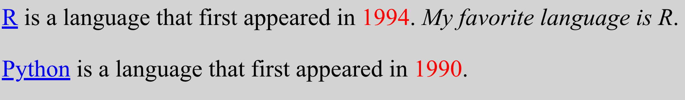

# A Brief Introduction to HTML & CSS

**H**yper**t**ext **M**arkup **L**anguage

**C**ascading **S**tyle **S**heets

## An ugly web page

```{r}
#| echo: false
#| fig-align: center
#| fig-alt: 'A screenshot of a web browser window displaying a simple webpage with a light gray background. The text is rendered in a large, 40px sans-serif font. It features two paragraphs: the first contains a blue hyperlinked "R" followed by text stating it appeared in 1994 (highlighted in red) and the sentence "My favorite language is R" in italics. The second paragraph contains a blue hyperlinked "Python" followed by text stating it appeared in 1990 (highlighted in red).'

```

## HTML document outline

<center>

<video width="80%" height="45%%" align = "center" controls>
  <source src="screencast/5-html-start.mp4" type="video/mp4">
</video>

</center>

## HTML document outline - code

In the previous screencast we wrote the following code in an html document. 

```html
<html>
  <head></head>
  
  <body>
    Hello world.
  </body>
  
</html>

```

## Paragraphs

<center>


<video width="80%" height="45%%" align = "center" controls>
  <source src="screencast/5-p-tag.mp4" type="video/mp4">
</video>

</center>

## Paragraphs - code

In the previous screencast we wrote the following code in an html document. 


```html
<html>
  <head></head>

  <body>
    <p>R is a language that first appeared in 1994. 
    My favorite language is R.</p>

    <p>Python is a language that first appeared in 1990.</p>
  </body>

</html>
```

## Hyperlinks

<center>


<video width="80%" height="45%%" align = "center" controls>
  <source src="screencast/5-a-tag.mp4" type="video/mp4">
</video>

</center>

## Hyperlinks - code

In the previous screencast we wrote the following code in an html document. 


```html
<html>
  <head></head>

  <body>
    <p><a href="[https://www.r-project.org/](https://www.r-project.org/)">R</a>
    is a language that first appeared in 1994.
      My favorite language is R.</p>

    <p><a href="[https://www.python.org/](https://www.python.org/)">Python
    </a> is a language that first appeared in 1990
    .</p>
  </body>

</html>
```


## Understanding each part of an hyperlink

`<a href="https://www.r-project.org/">R</a>`

. . .

::::{.columns}

:::{.column width="50%"}
`<a> </a>`
:::

:::{.column width="50%"}
HTML tag
:::

::::
. . .

::::{.columns}

:::{.column width="50%"}

`href`

:::

:::{.column width="50%"}
attribute (name)
:::

::::

. . .

::::{.columns}

:::{.column width="50%"}
`https://www.r-project.org/`
:::


:::{.column width="50%"}
attribute (value)
::: 

::::

. . .

::::{.columns}

:::{.column width="50%"}
`R`
:::

:::{.column width="50%"}
content
:::

::::


## Spans

<center>

<video width="80%" height="45%%" align = "center" controls>
  <source src="screencast/5-span-tag.mp4" type="video/mp4">
</video>

</center>

## Spans - code

In the previous screencast we wrote the following code in an html document. 


```html
<html>
  <head></head>

  <body>
    <p><a href="[https://www.r-project.org/](https://www.r-project.org/)">R</a> is a 
    language that first appeared in <span>1994</span>.
    <span>My favorite language is R</span>.</p>

    <p><a href="[https://www.python.org/](https://www.python.org/)">Python</a> is a 
    language that first appeared in <span>1990</span>.</p>
  </body>

</html>

```

## Styling

<center>

<video width="80%" height="45%%" align = "center" controls>
  <source src="screencast/5-style-css.mp4" type="video/mp4">
</video>

</center>

## Styling - code

In the previous screencast we wrote the following code in an html document. 

```html
<html>
  <head>
    <style>
      body {
        background-color: lightgray;
        font-size: 40px;
      }

      .year {
        color: red;
      }

      #favorite {
        font-style: italic;
      }
    </style>
  </head>

  <body>
    <p>
      <a href="https://www.r-project.org/">R</a> is a language that 
      first appeared in <span class="year">1994</span>.
      <span id="favorite">My favorite language is R</span>.
    </p>

    <p>
      <a href="https://www.python.org/">Python</a> is a language that 
      first appeared in <span class="year">1990</span>.
    </p>
  </body>
</html>
```

## Part of an HTML tree

```{r}
#| echo: false
#| fig-align: center
#| fig-alt: 'A Document Object Model (DOM) tree diagram illustrating the hierarchy of HTML elements. The top level is the <body> tag, which branches into two <p> (paragraph) tags. The first <p> tag further branches into several child nodes: an <a> tag with an href attribute containing the text "R", a text node "is a language that first appeared in", a <span> tag with the class ".year" containing the red text "1994", a punctuation node ".", a <span> tag with the ID "#favorite" containing the italicized text "My favorite language is R", and a final punctuation node ".".'
knitr::include_graphics(here::here("week05/img/html-tree.jpeg"))
```


# Web Scraping Demo

in your weekly repos

## Demo Summary


- Always check if bot access is allowed `robotstxt::paths_allowed()`

- We use `library(rvest)` for scraping data.

- The `read_html()` returns the html content of a web page for a given url.
- The `html_element()` function helps us select certain CSS classes and IDS.
- The `html_text2()` function returns the text content 

## Selector Gadget

[Selector Gadget Chrome Extension](https://chromewebstore.google.com/detail/selectorgadget/mhjhnkcfbdhnjickkkdbjoemdmbfginb?hl=en) helps find CSS selectors.

## Considerations

Finding data online does not grant permission to scrape and use the data

1. Is it ethical? Be especially mindful when using data from human subjects. Check out [Institutional Review Board](https://research.uci.edu/human-research-protections/) for regulations on doing research with human subjects data.

2. Is it legal? Check terms of use. Commercial use may not be permitted.


