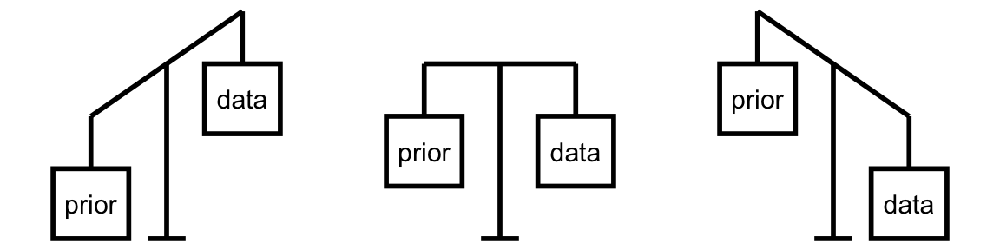

## Packages

```{r}
#| label: packages
library(bayesrules)
library(tidyverse)
```

```{r}
#| echo: false
#| label: theme-set
theme_set(theme_gray(base_size = 18))
```

Examples from this lecture are mainly taken from the [Bayes Rules! book](https://www.bayesrulesbook.com/) and the new functions are from the `bayesrules` package.


# Bayesian Inference


## Bechdel Test

Alison Bechdel’s 1985 comic Dykes to Watch Out For has a strip called [The Rule](https://www.npr.org/templates/story/story.php?storyId=94202522?storyId=94202522) where a person states that they only go to a movie if it satisfies the
following three rules:

- the movie has to have at least two women in it;

- these two women talk to each other; and

- they talk about something besides a man.

. . . 

This test is used for assessing movies in terms of representation of women. Even though there are three criteria, a movie either fails or passes the Bechdel test.

## Unknown

Let $\pi$ be the the proportion of movies that pass the Bechdel test.

. . . 

The Beta distribution is a good fit for modeling our prior understanding about $\pi$. 

. . . 

We will utilize functions from `library(bayesrules)` to examine different people's prior understanding of $\pi$ and build our own. 

## The Optimist

```{r}
#| fig-align: center
#| label: beta141
#| fig-alt: 'Curve showing how plausible different values of π are, with the highest point around 1. Values close to 0 are much less plausible. The curve starts rising from near 0.75, peaks around 1.'
summarize_beta(14, 1)

plot_beta(14, 1) 
```

## The Clueless

```{r}
#| fig-align: center
#| label: beta11
#| fig-alt: 'A flat line showing how plausible different values of π are at exactly f(pi) equalling 1 for all values of pi.'
summarize_beta(1, 1)

plot_beta(1, 1) 
```

## The Feminist

```{r}
#| fig-align: center
#| label: beta511
#| fig-alt: 'Curve showing how plausible different values of π are, with the highest point around 0.3. Values near 0.3 are most likely, while values close to 0 or 1 are much less plausible. The curve rises from near 0, peaks around 0.3, and then gradually decreases toward 1.'
summarize_beta(5, 11)

plot_beta(5, 11) 
```

## Vocabulary

__Informative prior:__ An informative prior reflects specific information about the unknown
variable with high certainty (ie. low variability).


__Vague (diffuse) prior:__

A vague or diffuse prior reflects little specific information about the unknown variable. A flat prior, which assigns equal prior plausibility to all possible values of the variable, is a special case.


## Quiz question

Which of these people are more certain (i.e. have a highly informative prior)?

- The optimist
- The clueless
- The feminist

## Plotting Beta Prior

```{r}
#| echo: false
#| message: false
#| fig-align: center
#| label: beta-prior
#| fig-alt: 'A 3×3 grid of line plots showing probability density functions for different Beta distributions on the interval 0 to 1 (x-axis labeled π, y-axis labeled f(π)). Each panel is titled with its parameter values: Beta(1,5), Beta(1,2), Beta(3,7), Beta(1,1), Beta(5,5), Beta(20,20), Beta(7,3), Beta(2,1), and Beta(5,1). The shapes vary across panels: Beta(1,1) is flat (uniform); Beta(1,5) and Beta(1,2) decrease from left to right (mass near 0); Beta(2,1) and Beta(5,1) increase toward 1 (mass near 1); Beta(3,7) peaks left of center; Beta(7,3) peaks right of center; Beta(5,5) is symmetric and moderately peaked at 0.5; and Beta(20,20) is sharply peaked around 0.5.'

library(tidyverse)
# Set up beta data

alpha <- c(1,1,3,1,5,20,7,2,5)
beta  <- c(5,2,7,1,5,20,3,1,1)
betas <- data.frame(setting = factor(rep(1:9, 
                                         each = 500)), 
                    x = rep(seq(0, 1, 
                                length = 500), 9),
                    alpha = rep(alpha, each = 500),
                    beta = rep(beta, each = 500))

betas <- betas |> 
  mutate(y = dbeta(x, shape1 = alpha, shape2 = beta))

levels(betas$setting) <-
  paste0("Beta(",alpha,",",beta,")")

trend_data <- data.frame(alpha, beta,
                         means = (alpha / (alpha +
                                             beta)),
                         modes = 
                           ((alpha - 1) / 
                              (alpha + beta - 2))) |> 
  mutate(Parameter = 
           paste0("Beta(",alpha,",",beta,")")) |> 
  mutate(setting = Parameter) |> 
  mutate(means_d = dbeta(means, alpha, beta), 
         modes_d = dbeta(modes, alpha, beta))

trend_data$setting <- factor(trend_data$setting, 
                             levels = c("Beta(1,5)",
                                        "Beta(1,2)",
                                        "Beta(3,7)",
                                        "Beta(1,1)",
                                        "Beta(5,5)",
                                        "Beta(20,20)",
                                        "Beta(7,3)",
                                        "Beta(2,1)",
                                        "Beta(5,1)"))
  
ggplot(betas, aes(x = x, y = y)) + 
  lims(x = c(0,1), y = c(0,5.5)) + 
  geom_line() + 
  facet_wrap(~ setting) + 
  labs(x = expression(pi), y =
         expression(paste("f(",pi,")"))) + 
  scale_x_continuous(breaks = c(0,0.25,0.5,0.75,1),
                     labels =
                       c("0","0.25","0.50","0.75","1")) +
  theme(text = element_text(size=20)) 

```

## Your prior

What is your prior model of $\pi$?

Utilize the `summarize_beta()` and `plot_beta()` functions to describe your own prior model of $\pi$.
Make sure to note this down. 
We will keep referring to this quite a lot. 

## Data

```{r}
#| label: bechdel-sample
set.seed(84735)
bechdel_sample <- sample_n(bechdel, 20)

```

We are taking a random sample of size 20 from the `bechdel` data frame using the `sample_n()` function. 

. . .

The `set.seed()` makes sure that we end up with the same set of 20 movies when we run the code. 
This will hold true for anyone in the class. 
So we can all reproduce each other's analyses, if we wanted to.
The number `84735` has no significance other than that it closely resembles BAYES. 


## Data

```{r}
#| label: glimpse-data
glimpse(bechdel_sample)
```

. . .

```{r}
#| label: count-data
count(bechdel_sample, binary)

```

## The Optimist 

```{r}
#| label: summarize-beta-binom
summarize_beta_binomial(14, 1, y = 9, n = 20)
```

## The Optimist 


```{r}
#| fig-align: center
#| fig-height: 5
#| label: plot-beta-binom
#| fig-alt: 'A single plot showing three overlaid curves on the interval 0 to 1 (x-axis labeled π, y-axis labeled density). A yellow curve labeled “prior” is heavily skewed toward 1, rising sharply near π = 1. A blue curve labeled “(scaled) likelihood” is centered around π ≈ 0.5 with a moderate spread. A green curve labeled “posterior” is shifted to the right of the likelihood, peaking around π ≈ 0.65 and narrower than the likelihood. The posterior lies between the prior and likelihood, reflecting an update toward higher values of π.'
plot_beta_binomial(14, 1, y = 9, n = 20)
```

## The Clueless 

```{r}
#| label: summarize-beta-binom2

summarize_beta_binomial(1, 1, y = 9, n = 20)
```


## The Clueless 


```{r}
#| fig-align: center
#| fig-height: 5
#| label: plot-beta-binom2
#| fig-alt: 'A single plot of two curves and a line on the interval 0 to 1 (x-axis labeled π, y-axis labeled density). The yellow “prior” is flat across the entire range, indicating a uniform distribution. The blue “(scaled) likelihood” and green “posterior” curves overlap almost perfectly, both symmetric and centered at π ≈ 0.5 with a bell-shaped peak. The posterior matches the likelihood closely, showing that the uniform prior has little influence on the updated distribution.'
plot_beta_binomial(1, 1, y = 9, n = 20)
```

## The Feminist 

```{r}
#| label: summarize-beta-binom3

summarize_beta_binomial(5, 11, y = 9, n = 20)
```


## The Feminist


```{r}
#| label: plot-beta-binom3
#| fig-align: center
#| fig-height: 5
#| fig-alt: A single plot of three curves. Prior peaks around when pi is 0.3, likelihood peaks around when pi is 0.45 and posterior is between the prior and likelihood and is more peaked than both.
plot_beta_binomial(5, 11, y = 9, n = 20)
```

## Comparison 


```{r}
#| label: comparison
#| fig-align: center
#| fig-width: 15
#| echo: false
#| fig-height: 5
#| fig-alt: The last three plots provided next to one another
library(patchwork)
optimist <- plot_beta_binomial(14, 1, y = 9, n = 20) +
  labs(title = "Optimist")
clueless <- plot_beta_binomial(1, 1, y = 9, n = 20) +
  labs(title = "Clueless")
feminist <- plot_beta_binomial(5, 11, y = 9, n = 20) +
  labs(title = "Feminist")

gridExtra::grid.arrange(optimist,  clueless, feminist, ncol=3)


```

## Your Posterior

Utilize `summarize_beta_binomial()` and `plot_beta_binomial()` functions to examine your own posterior model. 


## Balancing Act of Bayesian Analysis


```{r}
#| echo: false
#| out-width: 70%
#| fig-align: center
#| label: bayes-balance
#| fig-alt: Three weighing scales, each holding the prior on one side and data on the other. The left scale is tipped toward the prior, the middle is balanced, and the right is tipped toward the data.

```

In Bayesian methodology, the prior model and the data both contribute to our posterior model. 


## Different Data, Different Posteriors

Morteza, Nadide, and Ursula –  all share the optimistic Beta(14,1) prior for $\pi$ but each have access to different data. Morteza reviews movies from 1991. Nadide reviews movies from 2000 and Ursula reviews movies from 2013. How will the posterior distribution for each differ?

## Morteza's analysis

```{r}
#| label: bechdel-1991
bechdel_1991 <- filter(bechdel, year == 1991)
count(bechdel_1991, binary)


6/13
```

. . .

```{r}
#| label: summary-1991
summarize_beta_binomial(14, 1, y = 6, n = 13)
```

## Morteza's analysis

```{r}
#| fig-height: 5
#| fig-align: center
#| label: morteza-plot
#| fig-alt: The prior curve mostly has high values of pi as highly plausible with a peak at pi at 1. The likelihood has a wide range with a peak near 0.46. Posterior is in the middle with a peak around 0.72.
plot_beta_binomial(14, 1, y = 6, n = 13)
```

## Nadide's analysis

```{r}
#| label: bechdel-2000
bechdel_2000 <- filter(bechdel, year == 2000)
count(bechdel_2000, binary)

29/(34+29)
```

. . .

```{r}
#| label: summary-2000
summarize_beta_binomial(14, 1, y = 29, n = 63)
```

## Nadide's analysis

```{r}
#| fig-height: 5
#| fig-align: center
#| label: plot-nadide
#| fig-alt: The prior curve mostly has high values of pi as highly plausible with a peak at pi at 1. The likelihood has a narrower range compared to Morteza's plot with a peak near 0.46. Posterior is in the middle but this time closer to the likelihood with a peak around 0.55.
plot_beta_binomial(14, 1, y = 29, n = 63)
```

## Ursula's analysis

```{r}
#| label: bechdel-2013
bechdel_2013 <- filter(bechdel, year == 2013)
count(bechdel_2013, binary)

46/(53+46)
```

. . .

```{r}
#| label: summary-2013
summarize_beta_binomial(14, 1, y = 46, n = 99)
```


## Ursula's analysis

```{r}
#| fig-height: 5
#| fig-align: center
#| label: plot-ursula
#| fig-alt: The prior curve mostly has high values of pi as highly plausible with a peak at pi at 1. The likelihood has even a narrower range compared to Nadide's plot with a peak near 0.46. Posterior is in the middle but this time much closer to the likelihood with a peak around 0.52.
plot_beta_binomial(14, 1, y = 46, n = 99)

```

## Summary 

```{r}
#| echo: false
#| message: false
#| label: summary-beta-binomial-function
## Remove
## Code for facet_wrapped Beta-Binomial plots
### Plotting function
beta_binom_grid_plot <- function(data, likelihood = false, posterior = false){
  g <- ggplot(data, aes(x = pi, y = prior)) + 
    geom_line() + 
    geom_area(alpha = 0.5, aes(fill = "prior", x = pi, y = prior)) + 
    scale_fill_manual("", values = c(prior = "gold1", 
      `(scaled) likelihood` = "cyan2", posterior = "cyan4"), breaks = c("prior", "(scaled) likelihood", "posterior")) + 
    labs(x = expression(pi), y = "density") + 
    theme(legend.position="bottom")
  
  if(likelihood == TRUE){
    g <- g + 
      geom_line(aes(x = pi, y = likelihood)) + 
      geom_area(alpha = 0.5, aes(fill = "(scaled) likelihood", x = pi, y = likelihood))
  }
  
  if(posterior == TRUE){
    g <- g + 
      geom_line(aes(x = pi, y = posterior)) + 
      geom_area(alpha = 0.5, aes(fill = "posterior", x = pi, y = posterior)) 
  }
  g
}
make_plot_data <- function(as, bs, xs, ns, labs_prior, labs_likelihood){
  ### Set up data to call in plot
  # Refinement parameter
  size <- 250
  
  # Model settings
  pi <- rep(seq(0,1,length=size), 9)
  
  # Prior parameters
  a <- rep(as, each = size*3)
  b <- rep(bs, each = size*3)
  # Data
  x <- rep(rep(xs, each = size), 3)
  n <- rep(rep(ns, each = size), 3)
  # Posterior parameters
  a_post <- x + a
  b_post <- n - x + b
  # Labels
  setting_prior      <- as.factor(rep(1:3, each = size*3))
  setting_likelihood <- as.factor(rep(rep(1:3, each = size), 3))
  levels(setting_prior)      <- labs_prior
  levels(setting_likelihood) <- labs_likelihood    
  # Prior, likelihood, posterior functions
  bfun1 <- function(x){dbinom(x = xs[1], size = ns[1], prob = x)}
  bfun2 <- function(x){dbinom(x = xs[2], size = ns[2], prob = x)}
  bfun3 <- function(x){dbinom(x = xs[3], size = ns[3], prob = x)}
  scale   <- rep(rep(c(integrate(bfun1, 0, 1)[[1]], integrate(bfun2, 0, 1)[[1]], integrate(bfun3, 0, 1)[[1]]), each = size), 3)
  prior      <- dbeta(x = pi, shape1 = a, shape2 = b)
  likelihood <- dbinom(x = x, size = n, prob = pi) / scale
  posterior  <- dbeta(x = pi, shape1 = a_post, shape2 = b_post)
  # Combine into data frame
  data.frame(setting_prior, setting_likelihood, pi, a, b, x, n, likelihood, prior, posterior)
}
plot_dat <- make_plot_data(
  as = c(5,1,14), bs = c(11,1,1), 
  xs = c(6,29,46), ns = c(13,63,99), 
  labs_prior = c("prior: Beta(5,11)", "prior: Beta(1,1)", "prior: Beta(14,1)"), 
  labs_likelihood = c("data: Y = 6 of n = 13", "data: Y = 29 of n = 63", "data: Y = 46 of n = 99"))
```


```{r}
#| echo: false
#| fig-align: center
#| label: summary-beta-binomial
#| fig-alt: A summary plot with 3 by 3 totaling 9 plots. Columns represent three different data scenarios previously shown on these slides as Y=6 of n = 13, Y=29 of n=63, and Y=46 of n=99. Rows represent three different priors from top to bottom Beta(14,1), Beta(5,11), and Beta(1,1). When the number of observations increase for data then posterior is closer to the likelihood. When the prior is highly informative (extreme) then posterior is also more influenced by the prior compared to a less informative prior. In fact for a flat prior there is no impact of the prior.
plot_dat_new <- plot_dat |> 
  mutate(setting_prior = factor(setting_prior, 
                                levels = c("prior: Beta(14,1)", "prior: Beta(5,11)", "prior: Beta(1,1)")))
beta_binom_grid_plot(plot_dat_new, posterior = TRUE, likelihood = TRUE) + 
  facet_grid(setting_prior ~ setting_likelihood) +
  theme(text = element_text(size=17)) 
```


priors: Beta(14,1), Beta(5,11),  Beta(1,1)

