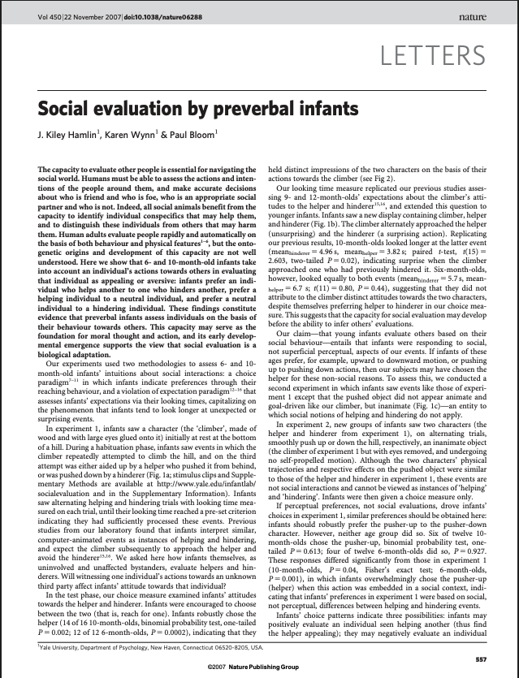

```{r}
#| echo: false
options(scipen=0)
library(bayesrules)
library(tidyverse)
library(scales)
```

```{r}
#| echo: false
theme_set(theme_bw(base_size = 18))
```

## Bayesian vs. Frequentist Inference

::::{.columns}


:::{.column width=50%}

**Bayesian**

P (Hypotheses | Data)
Hypotheses have probabilities in light of the observed data

:::


:::{.column}

**Frequentist**

P (Data | Hypotheses)

Data have probability considering the conditions of the hypotheses
:::


::::

. . .

<hr>


::::{.columns}


:::{.column width=50%}

Credible Intervals

:::


:::{.column}


Confidence Intervals

:::

::::

## Recall Bayesian Inference - Posterior Model

```{r}
#| fig-alt: In the posterior distribution of Beta(14,22) the area under the curve where pi is less than 0.33 is shaded with lightblue. The area corresponds to about 24% of the area under the curve.
#| echo: false
#| fig-align: center

plot_prob_plot <- function(a,b,cutoff){
  ggplot(data.frame(x = c(0,1)), aes(x=x)) + 
    stat_function(fun = dbeta, args = list(a, b), xlim = c(0,cutoff), geom = "area", fill = "lightblue") + 
    stat_function(fun = dbeta, args = list(a, b)) + 
    geom_segment(aes(x = cutoff, xend = cutoff, y = 0, yend = dbeta(cutoff, a, b))) +
    labs(x = expression(pi), y = "density")
}
plot_prob_plot(14, 22, cutoff = 0.33) + 
  lims(x = c(0, 1)) 
```

## Bayesian vs. Frequentist Inference

In the previous example we could talk about probability of the parameter. 

For instance $P(\pi<0.33 | y)$, in other words probability of the parameter being less than 0.33 given that we have observed data (9 out of 20 movies passed).

. . .

In frequentist inference we will talk about probability of data given some parameter value.


## Data Context

::::{.columns}

:::{.column width=70%}


[Hamlin, J. K., Wynn, K., & Bloom, P. (2007). Social evaluation by preverbal infants. Nature, 450(7169), 557-559.](https://www.nature.com/articles/nature06288)

as seen in Chance, B. L., & Rossman, A. J. (2006). Investigating statistical concepts, applications and methods 


:::

:::{.column width=30%}

```{r}
#| echo: false
#| fig-alt: screenshot of the first page of the manuscript titled Social evaluation by preverbal infants

```

:::

::::

## Experiment

Babies are watching a video with a helper or hinderer shape.

Then they are asked to pick a shape.

<hr>

[Videos](https://campuspress.yale.edu/infantlab/media/)

## Data

14 out of 16 infants (10-months old) have chosen the helper shape.
What are some possible explanations of this? 


## Write down

Write down all possible ideas that you can think of with your neighbor.

## Possible Explanations


::::{.columns}

:::{.column width=33%}
*Study Design*

- Color of the toy
- Right vs. left
- Shape of the toy

:::

:::{.column width=33%}
Hypothesis

- 10 months old babies are socially developed

:::

:::{.column width=33%}
Hypothesis

- 10 months old babies are making a random choice

:::

::::

# Hypotheses Testing

## Hypotheses To Test


Babies are making a random choice

Babies are not making a random choice

. . .

<hr>

Which of these is easier to model right now? 


## Assumption

Let’s assume that babies are making a random choice

Out of 16 babies, how many babies would you expect to choose the helper shape?

Could this number be 7? In other words, if babies were making random choices, would you be surprised to see 7 babies choose the helper shape?

- Could this number be 11?  
- Could this number be 3?  
- Could this number be 14? 

## Surprise threshold

What is your surprise threshold? Below and above which number would you start getting surprised?

```{r}
#| echo: false
#| fig-alt: number line starting from 0 and ending at 16 with integers only
library(ggplot2)
library(ggforce) # Required for drawing the perfect ellipse around '8'

# -------------------------------------------------------------------------
# 1. Base theme & components common to all plots
# -------------------------------------------------------------------------

# Define the Okabe-Ito colors
oi_green <- "#009E73"
oi_pink  <- "#CC79A7"

# Define the base data for the ticks and background grid
ticks_df <- data.frame(x = 0:16, y = 0)

shared_theme <- theme_minimal() +
  theme(
    panel.grid.major.x = element_line(color = "lightgray", linetype = "dotted"),
    panel.grid.minor.x = element_blank(),
    panel.grid.major.y = element_blank(),
    panel.grid.minor.y = element_blank(),
    axis.text.y        = element_blank(),
    axis.title         = element_blank(),
    axis.text.x        = element_text(size = 16, face = "bold", color = "black", vjust = -1),
    plot.margin        = margin(20, 20, 20, 20)
  )

# Base function to draw the underlying timeline framework
create_base_plot <- function() {
  ggplot() +
    # Draw the vertical tick marks
    geom_segment(data = ticks_df, aes(x = x, xend = x, y = -0.15, yend = 0.15), 
                 color = "#009E73", size = 0.5) +
    scale_x_continuous(breaks = 0:16, labels = 0:16, limits = c(-0.2, 16.2)) +
    scale_y_continuous(limits = c(-0.5, 0.5)) +
    shared_theme
}

# Oval highlighting the number 8
oval_highlight <- geom_ellipse(aes(x0 = 8, y0 = 0, a = 0.25, b = 0.35, angle = 0), 
                               color = oi_pink, size = 2, fill = NA)


# -------------------------------------------------------------------------
# Plot 1: Mixed Segments (Pink 0-6, Green 6-10, Pink 10-16) with Circle
# -------------------------------------------------------------------------

plot1_data <- data.frame(
  x = c(0, 6, 10),
  xend = c(6, 10, 16),
  color = c(oi_pink, oi_green, oi_pink)
)

p1 <- create_base_plot() +
  geom_segment(aes(x = 0, xend = 16, y = 0, yend = 0), 
               color = oi_green, size = 2.5, lineend = "butt")

p2 <- create_base_plot() +
  geom_segment(aes(x = 0, xend = 16, y = 0, yend = 0), 
               color = oi_green, size = 2.5, lineend = "butt") +
  oval_highlight

p3 <- create_base_plot() +
  geom_segment(data = plot1_data, aes(x = x, xend = xend, y = 0, yend = 0, color = color), 
               size = 2.5, lineend = "butt") +
  scale_color_identity() +
  oval_highlight

p1
```

## Surprise threshold

What is your surprise threshold? Below and above which number would you start getting surprised?

```{r}
#| echo: false
#| fig-alt: in the number line, number is circled
p2
```

## Surprise threshold

What is your surprise threshold? Below and above which number would you start getting surprised?

```{r}
#| echo: false
#| fig-alt: in the number line, number is circled, numbers 10 through 16 are highlighted with pink and numbers 0 to 6 are highlighted in pink. 0, 6, 10, and 16 are highlighted.
p3
```

## Simulate data


With your neighbor, flip a coin 16 times and record the number of heads that you observe. 
In other words, each group is a set of researchers observing the behavior of 16 babies from Randomville.


## Plot class data

## Conclusions

Hypotheses
Babies are making a random choice
Babies are not making a random choice

Do you agree with the authors claim “These findings constitute evidence that preverbal infants assess individuals on the basis of their behaviour towards others”? Why? Why not?
Do the findings generalize to all infants? 

## Surprise (extreme threshold)

- Instead of count of babies, we will often see surprise threshold set at 0.05 probability. This is a debatable topic what the surprise threshold should be. 

- If the sample observation is in the 0.05 highlighted region, then we would be “surprised”. In other words, if the sample is in the 0.05 highlighted region, then we would conclude that there is a low probability of observing a surprising sample like this one or something more extreme if the randomness model were true. 

- If the randomness model were true, there would be a low probability (less than 0.05) of observing a sample value like the one we have observed or something more extreme. So, we reject the randomness model and conclude the alternative model.

## Error

- Could we have possibly made an error?
- We rejected the randomness model. Let’s assume for a second that it were true, could we have observed 14 babies (or something more extreme) choosing the helper shape?
- Yes!!! Low probability but still possible. 
- If the randomness model were true and we rejected it, we made a Type 1 Error (𝛼)!!!
- We often set 𝛼 = 0.05 (debatable).

# Confidence Intervals

## From Testing to Estimation

We just tested the "Randomness Model" ($\pi = 0.5$) and found 14/16 babies was very surprising. We rejected the idea that they were just guessing.

. . .

**But that only tells us what the proportion *isn't*.**

If the true proportion of all babies who prefer the helper isn't 0.5, what is it?

- Is it 0.70?
- Is it 0.85?
- Is it 0.99?

## Confidence Intervals

**Confidence Intervals** help us move from a single "Yes/No" test to a range of plausible values for our parameter.

## What is "Plausible"?

Recall our **Surprise Threshold**. We get "surprised" if our data is too far away from what a model predicts.

Imagine testing every possible value for $\pi$ (the true proportion) from 0 to 1:

- If we assumed $\pi = 0.6$, would 14/16 be surprising? (Probably)
- If we assumed $\pi = 0.8$, would 14/16 be surprising? (Probably not)

. . .

## Confidence Intervals

A Confidence Interval is simply the collection of all values that would NOT make us surprised if we tested them as the null hypothesis. You can think of it as the "non-surprise" range for $\pi$.


## Catching the Parameter

In Frequentist inference, the true population proportion ($\pi$) is a **fixed** value. It is like a fish sitting still in the ocean.

- A **Point Estimate** (14/16 = 0.875) is like trying to hit the fish with a spear. It’s hard to be exactly right!
- A **Confidence Interval** is like throwing a net.

For our 16 infants, the 95% Confidence Interval is **(0.617, 0.984)**. 

We are 95% confident that the true proportion of babies who prefer the helper shape is between 61.7% and 98.4%. This is NOT a probability.


## Interpretation

**The "Confidence Level" (95%) is a property of the net's design.**

If we go fishing 100 times with this net, we expect that 95 of those times, the net will be wide enough and positioned well enough to catch the fish.

If we take a sample 100 times from the population over and over again, construct a confidence interval using each of the sample data, we would expect 95% of the confidence intervals to contain the true/unknown parameter value of $\pi$.


## Interpretation

Once we calculate our interval for the 16 babies, the interval is **fixed**. The true proportion is also **fixed**.

**Incorrect:** "There is a 95% probability that the true proportion is in this specific interval." Remember we can make probabilistic judgments about the parameter in Bayesian framework - not frequentist.

**Correct:** "We used a method that is, in the long run, expected to capture the true proportion 95% of the time successfully."

