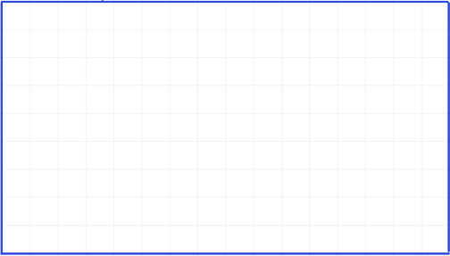

## Your Drawing

```{r}
#| fig-align: center
#| out-width: 50%
#| echo: false


```


## Your Algorithm

\newpage


## Test Your Algorithm

\begin{table}[H]
\centering
\renewcommand{\arraystretch}{2}
\begin{tabular}{|l|l|l|}
\hline
image\_id & actual\_class & predicted\_class \\ \hline
1         &        &           \\ \hline
2         &        &           \\ \hline
3         &        &           \\ \hline
4         &        &           \\ \hline
5         &        &           \\ \hline
6         &        &           \\ \hline
7         &        &           \\ \hline
8         &        &           \\ \hline
9         &        &           \\ \hline
10        &        &           \\ \hline
\end{tabular}
\end{table}

## 

| | **Predicted: OPEN** | **Predicted: CLOSED** |
| :--- | :--- | :--- |
| **Actual: OPEN** | <span style="color:green; font-weight:bold;">_________</span><br/> | <span style="color:orange; font-weight:bold;">________</span><br/> |
| **Actual: CLOSED**| <span style="color:red; font-weight:bold;">________</span><br/> | <span style="color:green; font-weight:bold;">________</span><br/> |