```{r}
options(scipen=0)
library(bayesrules)
library(tidyverse)
library(scales)
```

```{r}
#| echo: false
theme_set(theme_bw(base_size = 18))
```

## Models - The Big Idea

A model is a simplified representation of the real world.

::: {.nonincremental}

- Helps us understand or predict things
- Keeps **important features**
- Leaves out **unnecessary details**

:::

## Models - Example

A map is a model because it:

::: {.nonincremental}

- represents reality;  
- simplifies complexity;  
- follows clear rules.

:::

Includes: roads, intersections, landmarks

Excludes: every tree, person, and details of buildings


👉 Models are useful approximations, not perfect copies of reality.

## Models = Rules + Simplification

Good models

::: {.nonincremental}

- Keep what matters  
- Ignore what doesn’t  
- Follow consistent rules  

:::

👉 A model is like a structured, simplified view of reality

## Statistical Model

A statistical model is a model for data that maps:

👉 Inputs (explanatory variables) → Outputs (response variable classification or prediction)

It also:

::: {.nonincremental}

- Simplifies complex relationships
- Uses data to learn patterns
- Includes uncertainty (results are not perfectly predictable)

:::

## Classification Model

A model that sorts items into predefined categories or **classes.**

- Email clients filtering spam **(spam or not spam)**.
- Doctors using data to identify diseases from X-rays **(disease or no disease)**.
- Banks automatically detecting fraudulent credit card transactions **(fraud or no fraud)**.
- Image recognition algorithm identifying an image of a cat, a dog, or a bird **(cat, dog, bird)**.


## Image Data

By turning images into data, we can find patterns in images. 

Example:

- Identifying a tissue as cancerous or healthy
- An autonomous vehicle identifying a pedestrian, a car, a stop sign. 

## Step 0: Get into teams of 4 - 5

## Step 1: Create a landscape drawing area, 16 squares by 9 squares

::: {style="text-align: center;"}

```{r}
#| fig-align: center
#| echo: false
#| out-width: 60%
#| fig-alt: "A blank rectangular grid with a blue border and a white background overlaid with a uniform light blue grid of evenly spaced rows and columns, containing no data, labels, or axes, suggesting an empty chart or graph template awaiting content."
knitr::include_graphics("img/blank-grid.png")
```

:::

## Step 2: Draw _______ within your drawing area in less than 15 seconds without showing it to your teammates.

. . . 


## Step 2: Draw a book within your drawing area in less than 15 seconds without showing it to your neighbors.

```{r}
#| echo: false
countdown::countdown(minutes = 0, seconds = 15)
```


## Step 2.5: Now you can take a look at each others' drawings.

. . .

An example: 

```{r}
#| fig-align: center
#| echo: false
#| out-width: 60%
#| fig-alt: "A hand-drawn pencil sketch on graph paper, enclosed in a rectangular border, showing a simple open book icon drawn in pencil — two symmetrical curved pages spread open at a central spine, with diagonal lines on each page representing text"
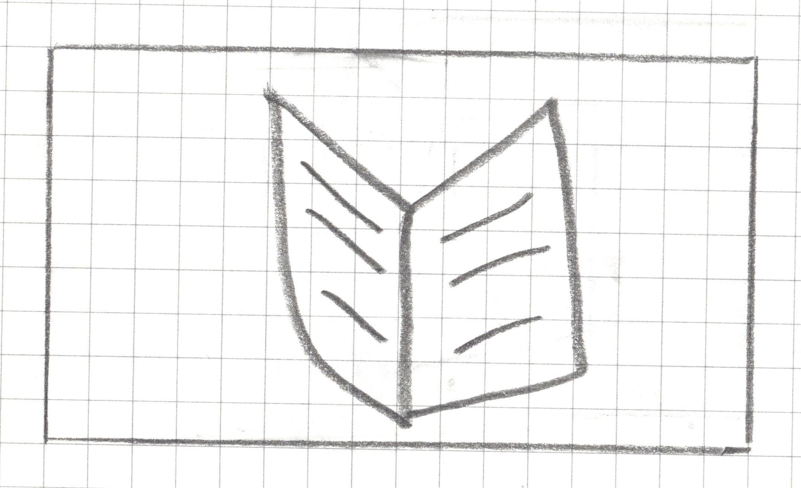
```


## Step 3: Pixelate your drawing

For any square that has a line, a dot or any pen/pencil mark, shade the whole square.

::: {style="text-align: center;"}

```{r}
#| fig-align: center
#| out-width: 60%
#| echo: false
#| fig-alt: A pixel art design drawn in pencil on a 16x9 graph paper grid. Columns and rows are not labeled but for the purposes of this alt text assume that the columns are labeled a-p, rows 1-9. The irregular shape consists of various shades of gray pencil markings, with some internal white (unshaded) cells. Shaded cells include f2, g2, k2, l2, f3, g3, h3, j3, l3, f4, g4, h4, i4, j4, k4, l4, f5, g5, h5, i5, j5, k5, l5, f6, g6, h6, i6, j6, l6, f7, g7, h7, i7, j7, k7, l7, g8, h8, j8, k8, l8, m8, h9, i9.
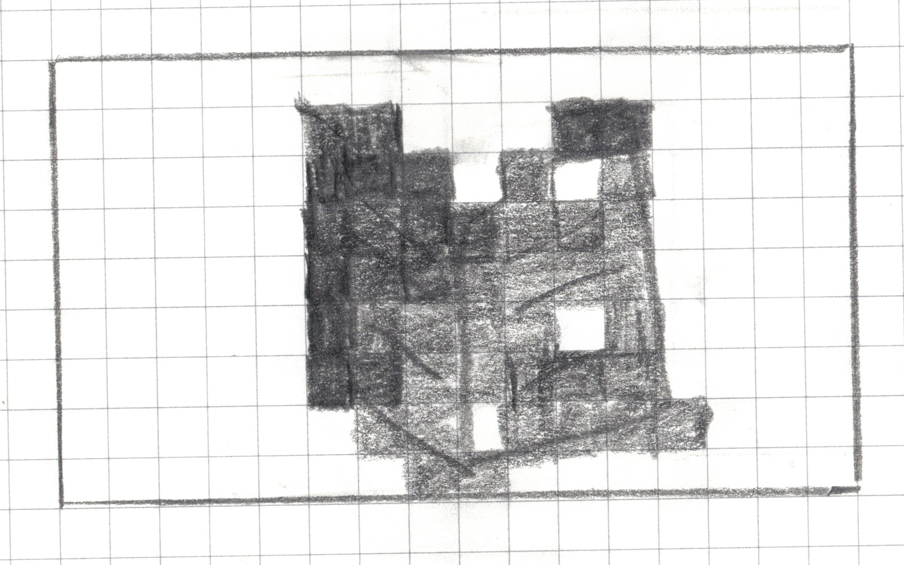
```

:::

## Step 4: Write your algorithm

Use your drawing as well as the drawings of your teammates (only your teammates) to come up with an algorithm (a set of rules) that can identify an open book. In other words, the algorithm should should identify whether the drawn book is open or closed.


## 


MY CLASSIFICATION ALGORITHM   
Algorithm Name: _______________________

My Rule (write it step-by-step):  
1. ____________________________________________________  
2. ____________________________________________________  
3. ____________________________________________________  
4. Classification Decision:  
   `if` _________________ `then` predict "open".  
   `else` predict "closed". 


## The Vertical Gap Scanner

1. Go through the image one row at a time, from top to bottom.

2. For each row, check if it qualifies as a "Gapped Row." A row is a "Gapped Row" if it meets both of these conditions:
- It has at least one filled-in square.
- It has 3 empty squares between its leftmost filled square and its rightmost filled square.


## The Vertical Gap Scanner

3. Count the number of gapped rows and save it as `gap_row_count`.

4. Classification Decision:  
  `if` `gap_row_count` >= 1 `then` predict "open".  
   `else` predict "closed". 

##

Step 5: Test your model

| image_id | actual_class | predicted_class |
|----------|--------|-----------|
| 1        |        |           |
| 2        |        |           |
| 3        |        |           |
| 4        |        |           |
| 5        |        |           |
| 6        |        |           |
| 7        |        |           |
| 8        |        |           |
| 9        |        |           |
| 10       |        |           |

## Image 1

::: {style="text-align: center;"}

```{r}
#| fig-align: center
#| out-width: 60%
#| echo: false
#| fig-alt: closed book image with only edges and spine drawn from the back cover view
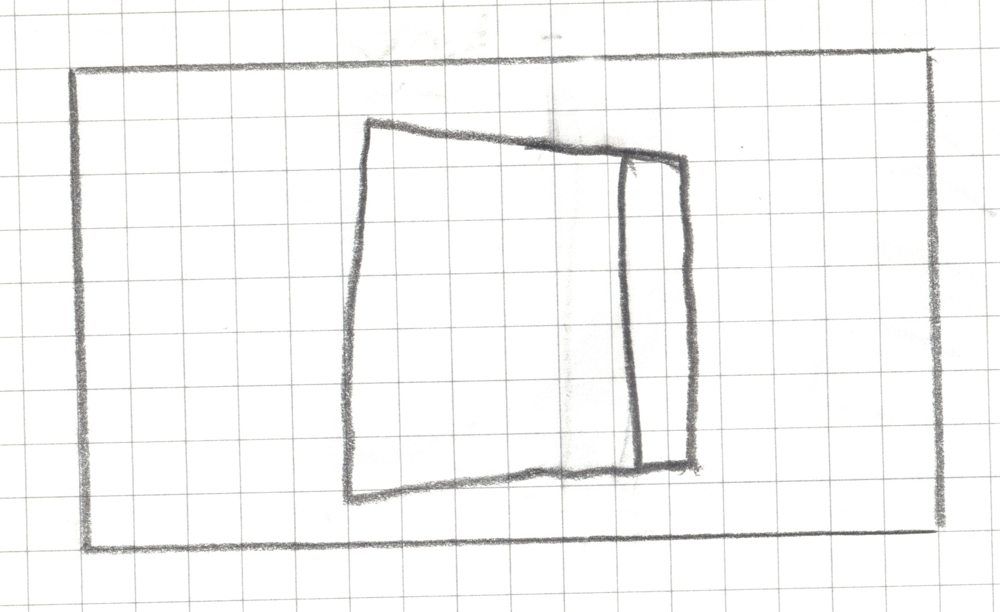
```

:::

`actual_class` = closed


## Image 1

::: {style="text-align: center;"}

```{r}
#| fig-align: center
#| out-width: 60%
#| echo: false
#| fig-alt: A pixel art design drawn in pencil on a 16x9 graph paper grid. Columns and rows are not labeled but for the purposes of this alt text assume that the columns are labeled a-p, rows 1-9. The irregular shape consists of various shades of gray pencil markings, with some internal white (unshaded) cells. Shaded cells include f2, g2, h2, i2, j2, k2, f3, k3, l3, f4, k4, l4, f5, k5, l5, f6, k6, l6, f7, k7, l7, f8, g8, h8, i8, j8, k8, l8
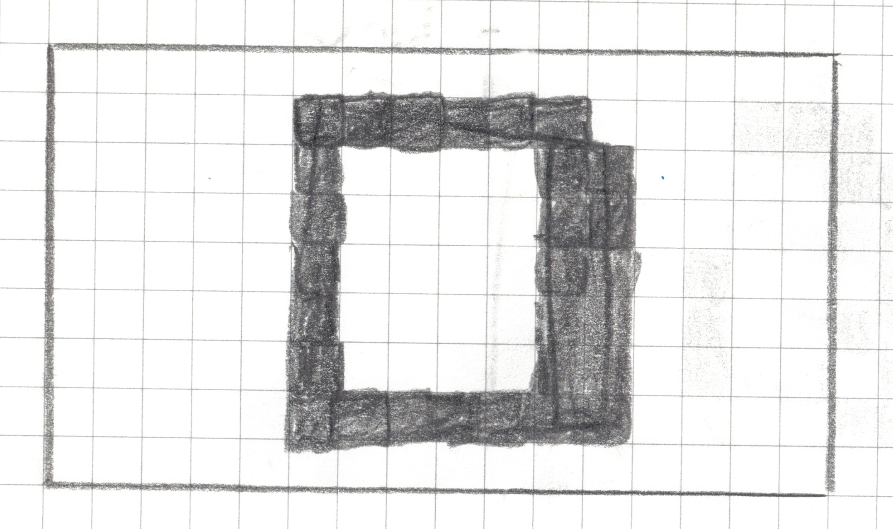
```

:::

`predicted_class` = ?


## Image 2

::: {style="text-align: center;"}

```{r}
#| fig-align: center
#| out-width: 60%
#| fig-alt: An open book illustration with only edges drawn. We can see back cover spine and front cover.
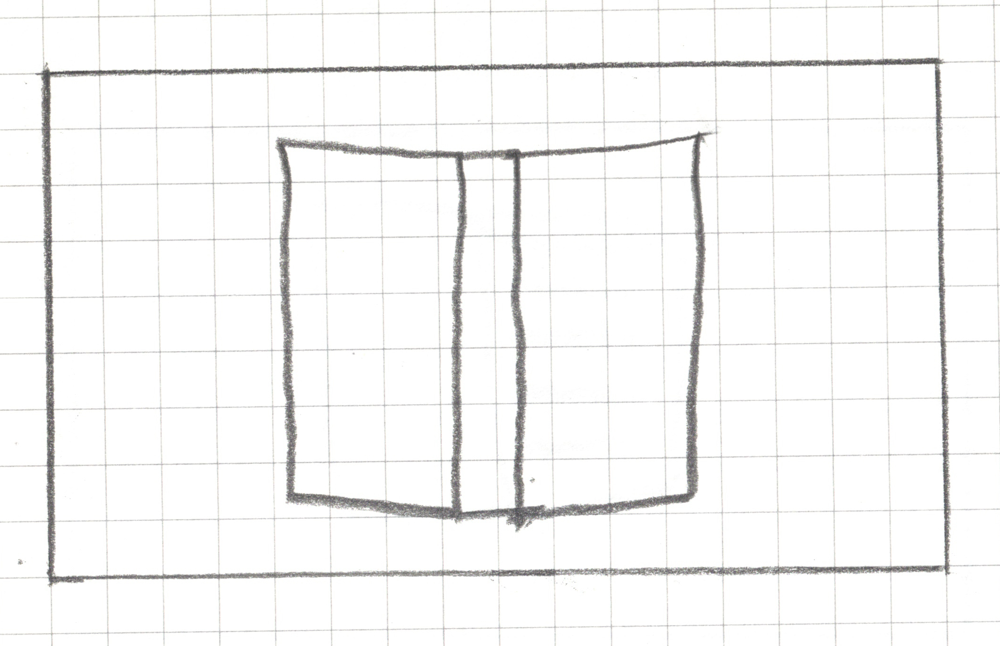
```

:::

`actual_class` = open


## Image 2

::: {style="text-align: center;"}

```{r}
#| fig-align: center
#| out-width: 60%
#| echo: false
#| fig-alt: A pixel art design drawn in pencil on a 16x9 graph paper grid. Columns and rows are not labeled but for the purposes of this alt text assume that the columns are labeled a-p, rows 1-9. The irregular shape consists of various shades of gray pencil markings, with some internal white (unshaded) cells. Shaded cells include e2, f2, g2, h2, i2, j2, k2, l2, e3, h3, i3, l3, e4, h4, i4, l4, e5, h5, i5, l5, e6, h6, i6, l6, e7, h7, i7, l7, e8, f8, g8, h8, i8, j8, k8, l8.
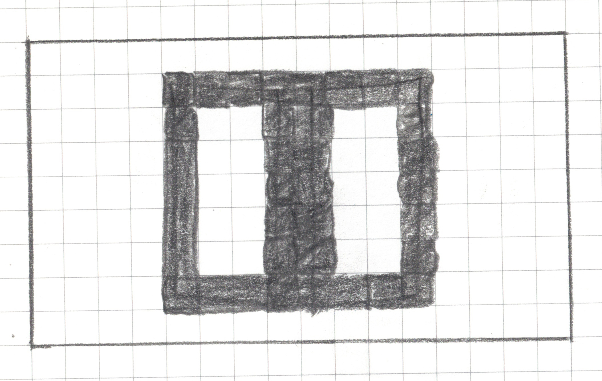
```

:::

`predicted_class` = ?


## Image 3

::: {style="text-align: center;"}

```{r}
#| fig-align: center
#| out-width: 60%
#| fig-alt: an open book viewed from a slight overhead angle, giving it a three-dimensional, tent-like appearance where the spine points upward.
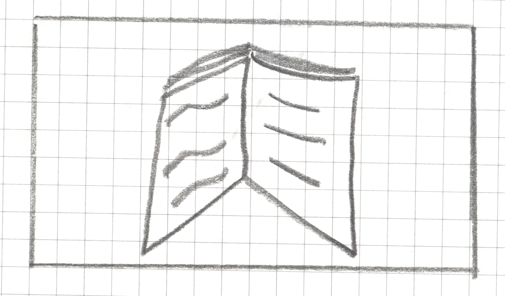
```

:::

`actual_class` = open


## Image 3

::: {style="text-align: center;"}

```{r}
#| fig-align: center
#| out-width: 60%
#| fig-alt: A pixel art design drawn in pencil on a 16x9 graph paper grid. Columns and rows are not labeled but for the purposes of this alt text assume that the columns are labeled a-p, rows 1-9. The irregular shape consists of various shades of gray pencil markings, with some internal white (unshaded) cells. Shaded cells include h1, f2, g2, h2, i2, j2, k2, l2, f3, g3, h3, i3, j3, l3, e4, f4, h4, i4, k4, l4, e5, f5, g5, h5, i5, j5, k5, l5, e6, f6, g6, h6, j6, k6, l6, e7, f7, g7, h7, i7, j7, l7, e8, f8, k8, l8, e9, l9
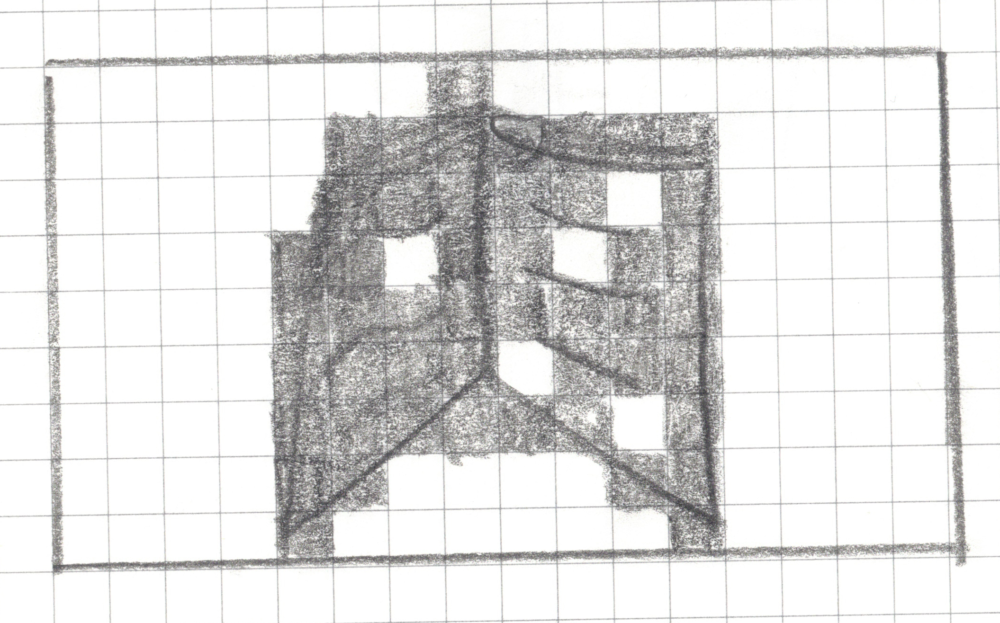
```

:::

`predicted_class` = ?


## Image 4

::: {style="text-align: center;"}

```{r}
#| fig-align: center
#| out-width: 60%
#| fig-alt: The drawing depicts an open book or notebook viewed from a straight-on perspective. The book is split into two pages by a central vertical line representing the spine. The left page is completely blank. The right page features five thick, straight, horizontal pencil strokes stacked vertically to represent lines of written text.
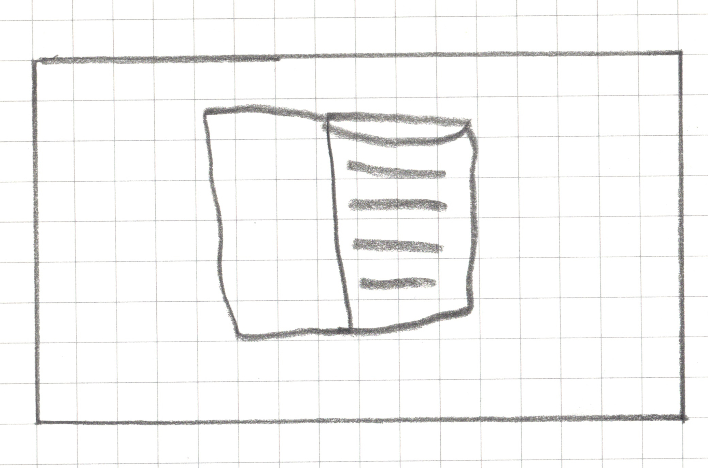
```

:::

`actual_class` = open


## Image 4

::: {style="text-align: center;"}

```{r}
#| fig-align: center
#| out-width: 60%
#| fig-alt: A pixel art design drawn in pencil on a 16x9 graph paper grid. Columns and rows are not labeled but for the purposes of this alt text assume that the columns are labeled a-p, rows 1-9. The irregular shape consists of various shades of gray pencil markings, with some internal white (unshaded) cells. Shaded cells include e2, f2, g2, h2, i2, j2, k2, e3, h3, i3, j3, k3, e4, h4, i4, j4, k4, e5, h5, i5, j5, k5, e6, h6, i6, j6, k6, e7, f7, g7, h7, i7, j7, k7
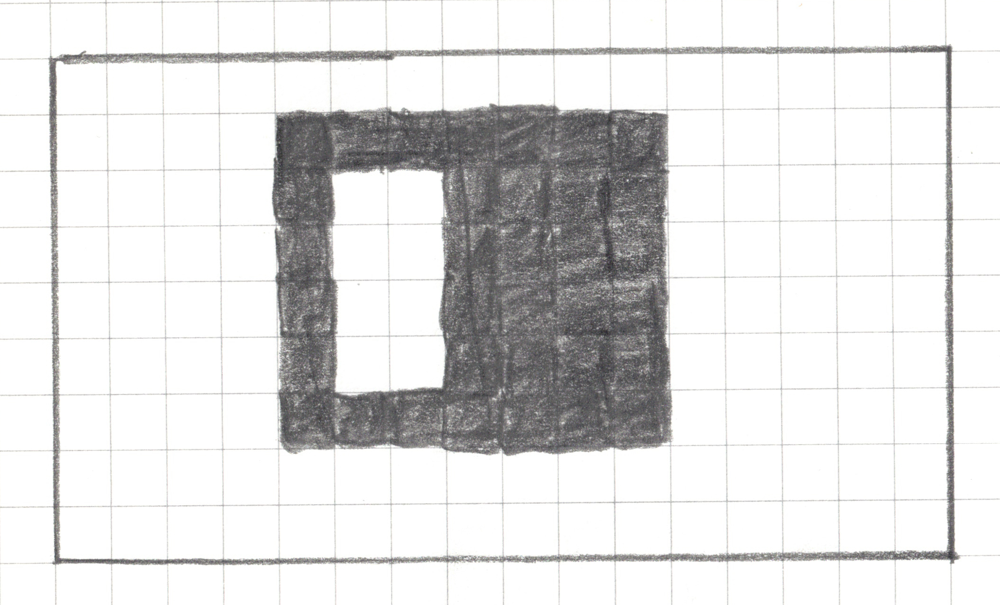
```

:::

`predicted_class` = ?


## Image 5

::: {style="text-align: center;"}

```{r}
#| fig-align: center
#| out-width: 60%
#| fig-alt: The drawing depicts a single closed book standing upright and viewed from a dynamic three-quarter side angle.
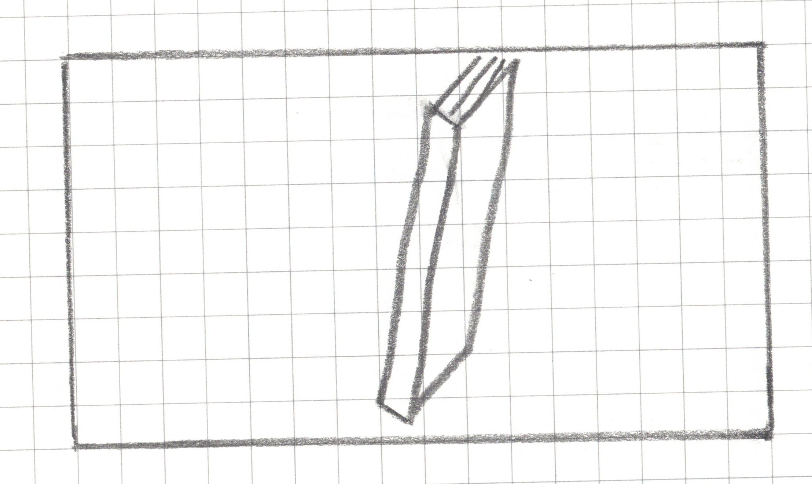
```

:::

`actual_class` = closed


## Image 5

::: {style="text-align: center;"}

```{r}
#| fig-align: center
#| out-width: 60%
#| fig-alt: A pixel art design drawn in pencil on a 16x9 graph paper grid. Columns and rows are not labeled but for the purposes of this alt text assume that the columns are labeled a-p, rows 1-9. The irregular shape consists of various shades of gray pencil markings, with some internal white (unshaded) cells. Shaded cells include i1, j1, k1, i2, j2, i3, j3, h4, i4, j4, h5, i5, j5, h5, i6, j6, h7, i7, j7, h8, i8, h9
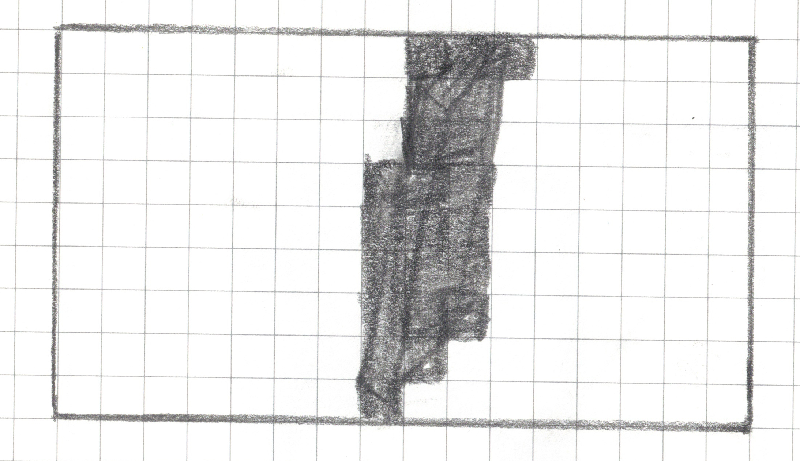
```

:::

`predicted_class` = ?


## Image 6

::: {style="text-align: center;"}

```{r}
#| fig-align: center
#| out-width: 60%
#| fig-alt: A view looking directly at the exposed page edges of a thick, closed book. The shape is bounded by a U-shaped bottom curve representing the book's cover, while the top edge dips downward in a smooth, concave crescent curve to suggest the natural indentation of the pages near the spine.
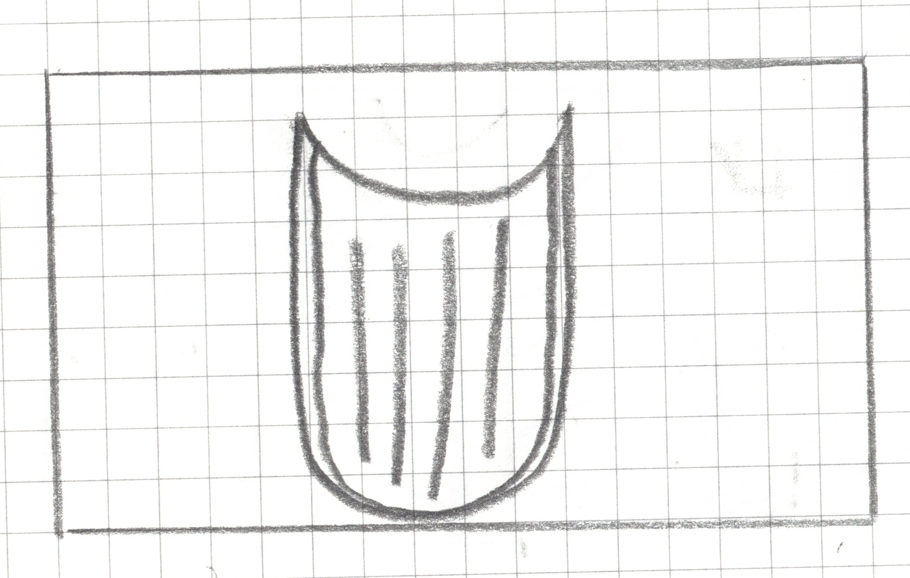
```

:::

`actual_class` = closed


## Image 6

::: {style="text-align: center;"}

```{r}
#| fig-align: center
#| out-width: 60%
#| fig-alt: A pixel art design drawn in pencil on a 16x9 graph paper grid. Columns and rows are not labeled but for the purposes of this alt text assume that the columns are labeled a-p, rows 1-9. The irregular shape consists of various shades of gray pencil markings, with some internal white (unshaded) cells. Shaded cells include f2, j2, f3, g3, h3, i3, j3, f4, g4, h4, i4, j4, f5, g5, h5, i5, j5, f6, g6, h6, i6, j6, f7, g7, h7, i7, j7, f8, g8, h8, i8, j8, f9, g9, h9, i9, j9
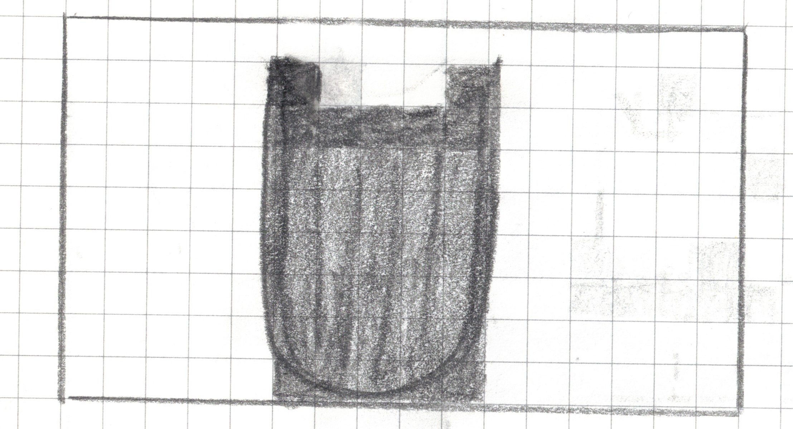
```

:::

`predicted_class` = ?


## Image 7

::: {style="text-align: center;"}

```{r}
#| fig-align: center
#| out-width: 60%
#| fig-alt: The drawing depicts an open book viewed from a slight front-facing angle.The book is divided down the center by a vertical line representing the spine. Both the left and right pages are angled slightly outward. The pages feature three horizontal, slightly tilted pencil strokes indicating lines of text.
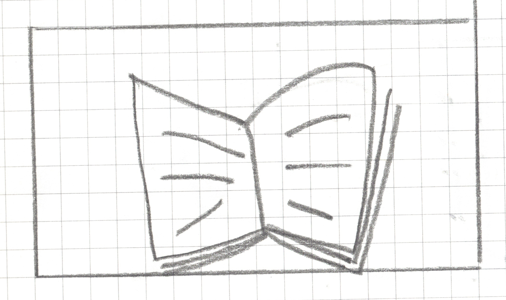
```

:::

`actual_class` = open

## Image 7

::: {style="text-align: center;"}

```{r}
#| fig-align: center
#| out-width: 60%
#| fig-alt: A pixel art design drawn in pencil on a 16x9 graph paper grid. Columns and rows are not labeled but for the purposes of this alt text assume that the columns are labeled a-p, rows 1-9. The irregular shape consists of various shades of gray pencil markings, with some internal white (unshaded) cells. Shaded cells include d2, k2, l2, m2, d3, e3, f3, i3, j3, m3, d4, e4, g4, h4, i4, j4, k4, l4, m4, n4, d5, f5, g5, h5,i5, m5, d6, e6, f6, g6, h6, j6, k6, l6, m6, e7, g7, i7, j7, k7, l7, m7, e8, f8, h8, i8, j8, k8, l8, m8, e9, f9, g9, h9, j9, k9, l9.

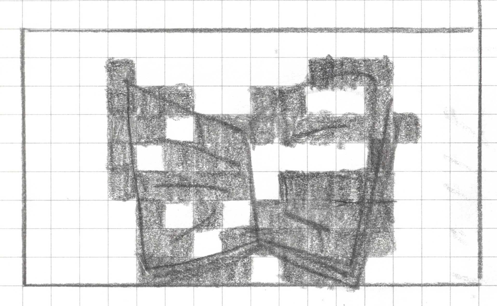
```

:::

`predicted_class` = ?

## Image 8

::: {style="text-align: center;"}

```{r}
#| fig-align: center
#| out-width: 60%
#| fig-alt: an open book viewed from a direct, front-facing perspective. The book is split symmetrically down the middle by a straight vertical line indicating the spine.
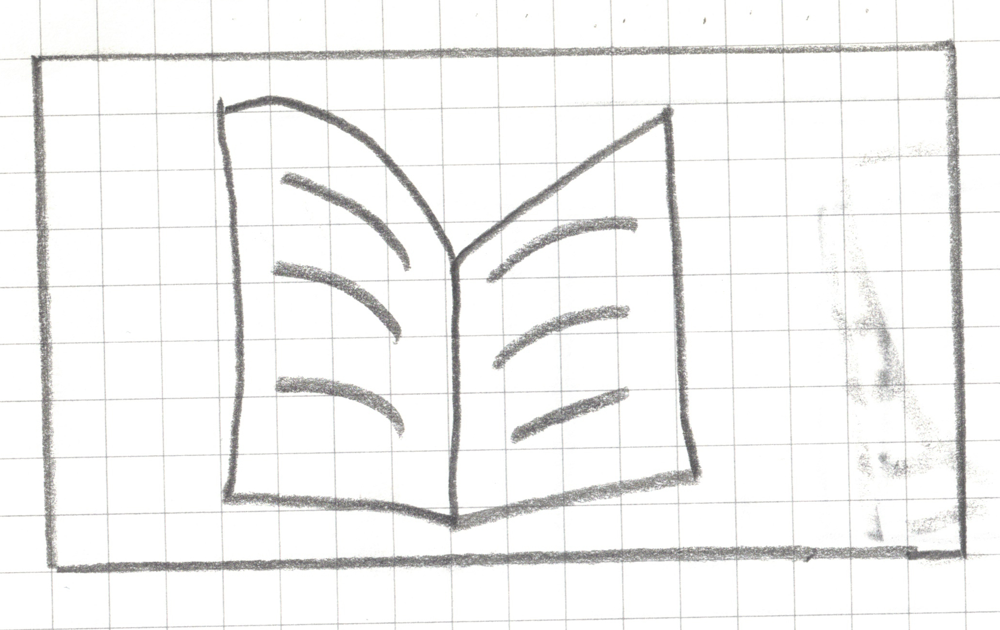
```

:::

`actual_class` = open

## Image 8

::: {style="text-align: center;"}

```{r}
#| fig-align: center
#| out-width: 60%
#| fig-alt: A pixel art design drawn in pencil on a 16x9 graph paper grid. Columns and rows are not labeled but for the purposes of this alt text assume that the columns are labeled a-p, rows 1-9. The irregular shape consists of various shades of gray pencil markings, with some internal white (unshaded) cells. Shaded cells include d1, e1, d2, f2, j2, k2, d3, e3, f3, g3, i3, j3, k3, d4, e4, g4 h4, i4, j4, k4, d5, f5, h5, i5, j5, k5, d6, e6, f6, i6, l6, d7, f7, g7, h7, i7, j7, l7, d8, e8, f8, h8, j8, k8, l8 , g9, h9, i9
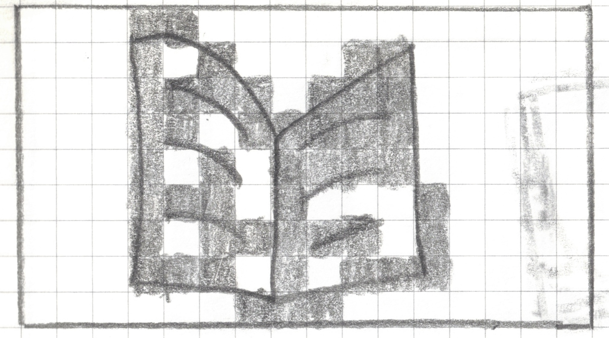
```

:::


`predicted_class` = ?

## Image 9

::: {style="text-align: center;"}

```{r}
#| fig-align: center
#| out-width: 60%
#| fig-alt: an open book or journal viewed from a three-quarter perspective, tilted slightly to the right. The book is split by a central line for the spine, with both pages completely blank inside. Along the bottom edge of the spine, a small U-shaped loop curves downward.
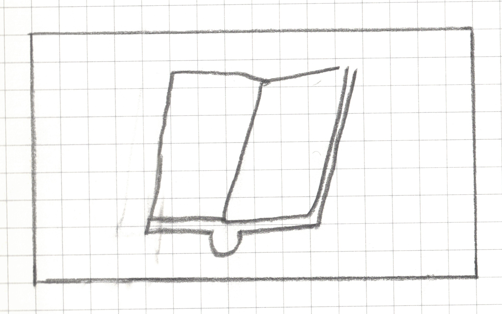
```

:::

`actual_class` = open

## Image 9

::: {style="text-align: center;"}

```{r}
#| fig-align: center
#| out-width: 60%
#| fig-alt: A pixel art design drawn in pencil on a 16x9 graph paper grid. Columns and rows are not labeled but for the purposes of this alt text assume that the columns are labeled a-p, rows 1-9. The irregular shape consists of various shades of gray pencil markings, with some internal white (unshaded) cells. Shaded cells include f2, g2, h2, i2, j2, k2, l2, e3, f3, i3, l3, e4, h4, k4, l4, e5, h5, k5, e6, h6, k6, e7, f7, g7, i7, j7, k7, e8, f8, g8, h8, i8, j8, k8
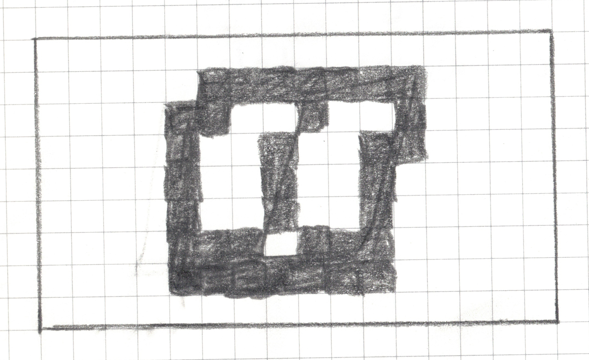
```

:::

`predicted_class` = ?

## Image 10

::: {style="text-align: center;"}

```{r}
#| fig-align: center
#| out-width: 60%
#| fig-alt: Outline of an open book, rendered from an angled perspective that tilts slightly away and down. The image is formed using basic geometric shapes, two blank, adjoining four-sided panels that share a slanted central line for the spine.

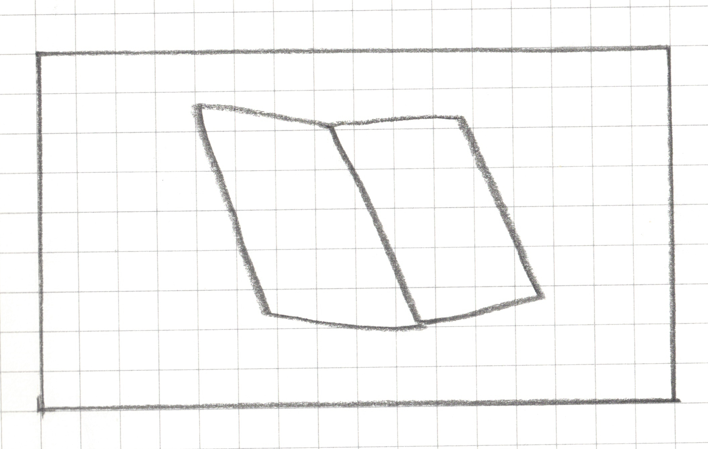
```

:::

`actual_class` = open

## Image 10

::: {style="text-align: center;"}

```{r}
#| fig-align: center
#| out-width: 60%
#| fig-alt: A pixel art design drawn in pencil on a 16x9 graph paper grid. Columns and rows are not labeled but for the purposes of this alt text assume that the columns are labeled a-p, rows 1-9. The irregular shape consists of various shades of gray pencil markings, with some internal white (unshaded) cells. Shaded cells include e2, f2, g2, h2, i2, j2, k2, e3, h3, l3, e4, i4, l4, e5, i5, l5, f6, i6, j6, m6, f7, g7, h7, i7, j7, k7, l7, m7
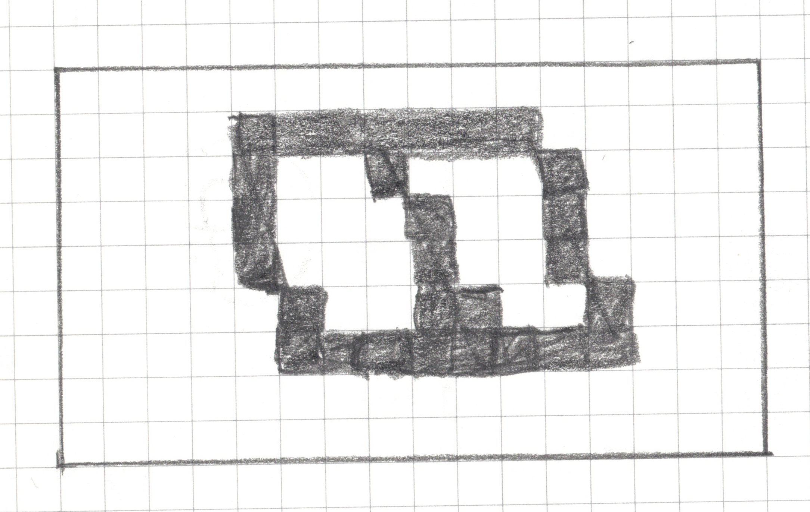
```

:::

`predicted_class` = ?

## More Testing Data


[Quick, Draw](https://quickdraw.withgoogle.com/data/book)

## Model Evaluation

| | **Predicted: OPEN** | **Predicted: CLOSED** |
| :--- | :--- | :--- |
| **Actual: OPEN** | <span style="color:green; font-weight:bold;">_________</span><br/>**(True Positive)** | <span style="color:orange; font-weight:bold;">________</span><br/>**(False Negative)** |
| **Actual: CLOSED**| <span style="color:red; font-weight:bold;">_______</span><br/>**(False Positive)** | <span style="color:green; font-weight:bold;">________</span><br/>**(True Negative)** |

## Model Evaluation


::: {.incremental}
-   <span style="color:green;">**True Positives (TP): **</span><br/>The model correctly predicted "OPEN" ____ times.

-   <span style="color:green;">**True Negatives (TN): **</span><br/>The model correctly predicted "CLOSED" ____ times.

-   <span style="color:red;">**False Positives (FP): **</span><br/>The model incorrectly predicted "OPEN" ____ times.

-   <span style="color:orange;">**False Negatives (FN): **</span><br/>The model incorrectly predicted "CLOSED" when the book was actually open ____ times.

-   **Overall Accuracy:** (Correct / Total) = ____
:::

## Discuss 


In a medical test, which one has worse consequences false negative or false positive? Discuss the implications of both of these possible results.


# Detour 

Fashion Models vs. Statistical Models


## The Sewing Pattern as an Algorithm

A sewing pattern is a precise, step-by-step set of instructions:

Cut the fabric into pieces of specific shapes and sizes.  
Pin piece A to piece B along a 5/8-inch seam allowance.  
Stitch the side seams together.  
Attach the sleeves to the armhole.  
Install the lining.  
Sew on the buttons and buttonholes.  


## The Finished Jacket as a Model

Once you follow the sewing pattern (algorithm) using a specific fabric and specific people's measurements (your data), you end up with a completed, tailored jacket. That jacket IS the model.

## Training a Model

Consider a clothing store who made a jacket that fits perfectly on their fashion models.

::: {style="text-align: center;"}


```{r}
#| echo: false
#| out-width: 55%
#| fig-align: center
#| fig-alt: Illustration of 3 male looking models on a runway in exact same jacket, belt, pants, and shoes. 
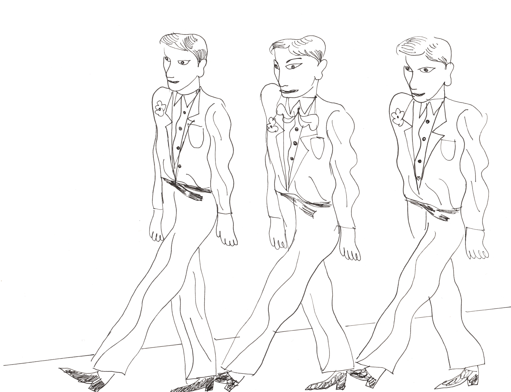
```

:::

## Testing a Model


When it comes to selling this jacket, they run into an issue. Can you identify the problem?

::: {style="text-align: center;"}


```{r}
#| echo: false
#| out-width: 55%
#| fig-align: center
#| fig-alt: The same jacket and pants worn by three different people with very different body types. The middle figure is tall, hence the jacket arms and pants legs are too short for them, the righ figure is short and the jacket arms and pants legs are too large for them. 
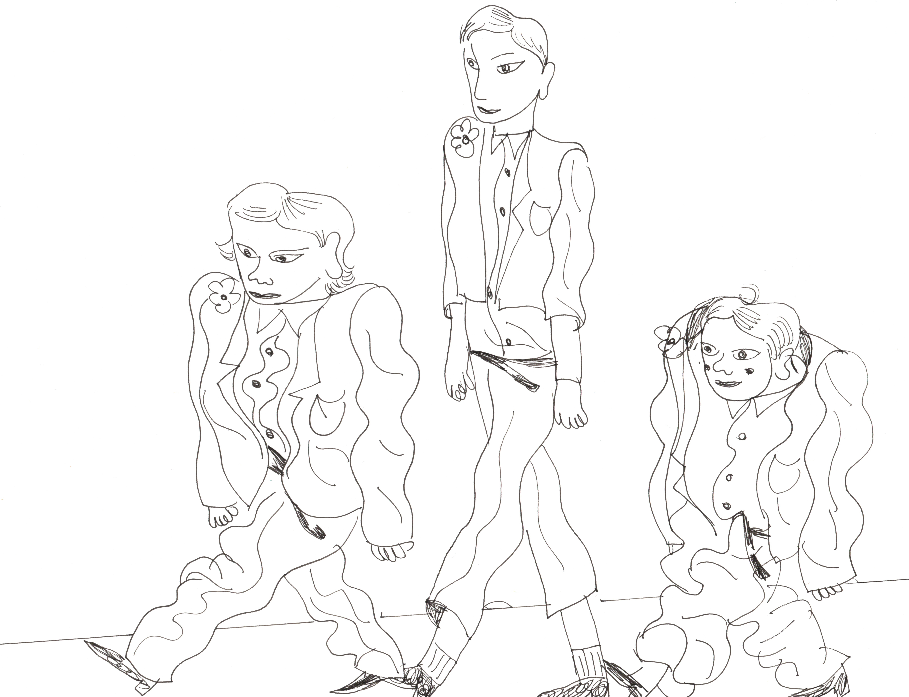
```

:::

## Training (Building) a Model 

While training a model, you use the algorithm with the data at hand to build and refine the model. 
The algorithm tells you to stitch the two arms of the jacket but your data determines how long the arms will be. 

## Testing a Model

Testing checks whether the jacket (model) truly fits well in the real world, or whether it was only tailored perfectly to the original practice measurements (data) it was trained on.
If it fits new sample well, the model generalizes well. 
If it looks awkward or doesn't fit, the model has a problem — perhaps it was overfit, meaning it was too narrowly tailored (i.e., perfectly fit) to the original training data.


## Key Take Aways

1.  **Computers See Data, Not Pictures.**
    We learned to translate a visual concept (a book) into structured data (a grid of 0s and 1s) that a computer can understand.

2.  **An Algorithm is a Set of Rules.**
    We created algorithms—step-by-step instructions—to sort our data. An algorithm is the *recipe* for finding patterns.

3.  **A Model is the Result of Training.**
    Our final, specific rule (e.g., "Predict "open" if `gap_row_count` >= 1") is our **model**. It's the *finished cake* we can use to make classifications.
    

## Key Take Aways

4.  **No Model is Perfect.**
    Every model has strengths and weaknesses. "All models are wrong, but some are useful" George Fox

5.  **Evaluation is Crucial.**
    We must test our model on unseen data to find its flaws (False Positives and False Negatives) and truly understand how well it works. A model is only as good as its test results.
    
## Binary Classification

Our response variable was categorical and had two categories (classes), i.e., `open` is a binary variable with TRUE or FALSE as possible values.

. . .

Thus the activity we just completed is a binary classification task. 

## Multiclass (multinomial) classification

`open`, `closed`, `half-open`

. . .

```{r}
#| fig-align: center
#| out-width: 60%
#| fig-alt: a book where the cover is half-way open and a tiny fraction of a page with text is visible. 
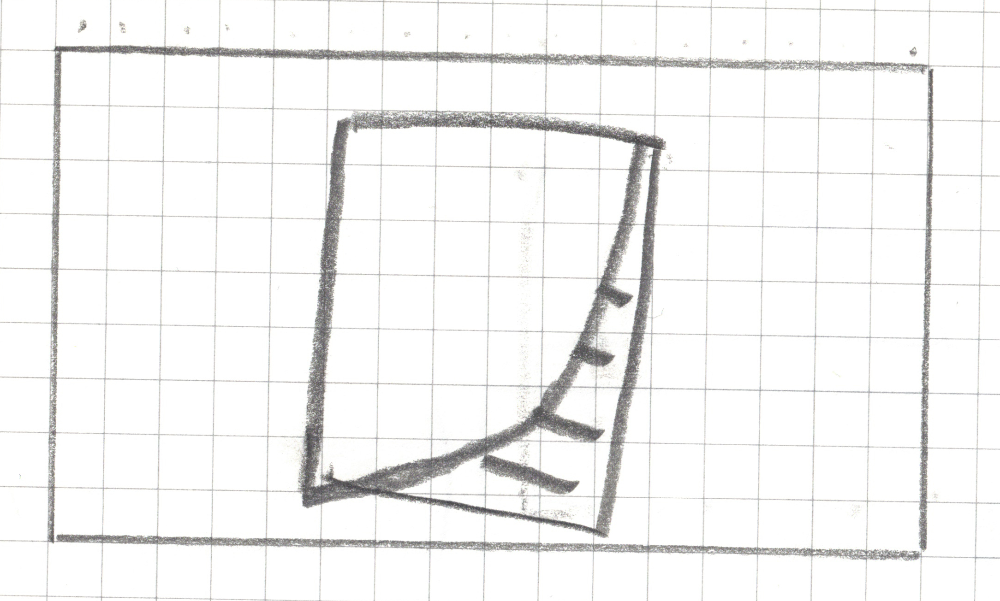
```


## PollEV